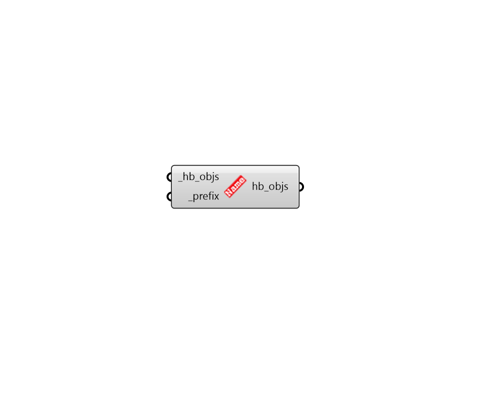

# Add Prefix

 - [\[source code\]](https://github.com/ladybug-tools/honeybee-grasshopper-core/blob/master/honeybee_grasshopper_core/src//HB%20Add%20Prefix.py)

Change the display name and identifier of this object and all child objects by inserting a prefix.

This is particularly useful in workflows where you duplicate and edit a starting object and then want to combine it with the original object into one Model \(like making a model of repeated rooms\) since all objects within a Model must have unique identifiers.

## Inputs

* **hb\_objs \[Required\]**

  A Honeybee Room, Face, Shade, Aperture, or Door to which a prefix should be added to its name. 

* **prefix \[Required\]**

  Text that will be inserted at the start of this object's \(and child objects'\) identifier and display\_name. This will also be added to any Surface boundary conditions of Faces, Apertures, or Doors. It is recommended that this prefix be short to avoid maxing out the 100 allowable characters for honeybee identifiers. This can also be a list of prefixes that correspond to the input \_hb\_objs 

## Outputs

* **hb\_objs**

  The input Honeybee objects with a prefix added to their display names and identifiers. 

