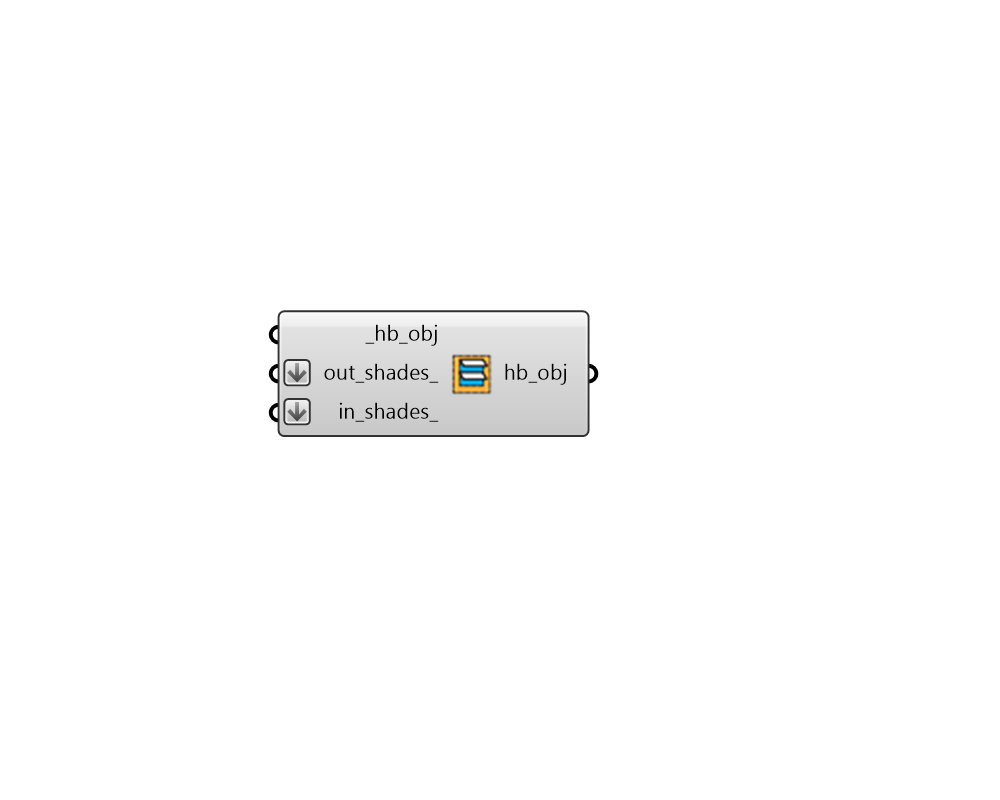

# Add Shade

 - [\[source code\]](https://github.com/ladybug-tools/honeybee-grasshopper-core/blob/master/honeybee_grasshopper_core/src//HB%20Add%20Shade.py)

Add a Honeybee Shades to an Aperture, Door, Face or Room.

## Inputs

* **hb\_obj \[Required\]**

  A Honeybee Aperture, Door, Face or a Room to which the shades should be added. 

* **out\_shades**

  A list of Honeybee Shade objects to be added to the outside of the input \_hb\_objs. 

* **in\_shades**

  A list of Honeybee Shade objects to be added to the inside of the input \_hb\_objs. Note that, by default, indoor shades are not used in energy simulations but they are used in all simulations involving Radiance. 

## Outputs

* **hb\_obj**

  The input Honeybee Aperture, Face or a Room with the input shades added to it. 

