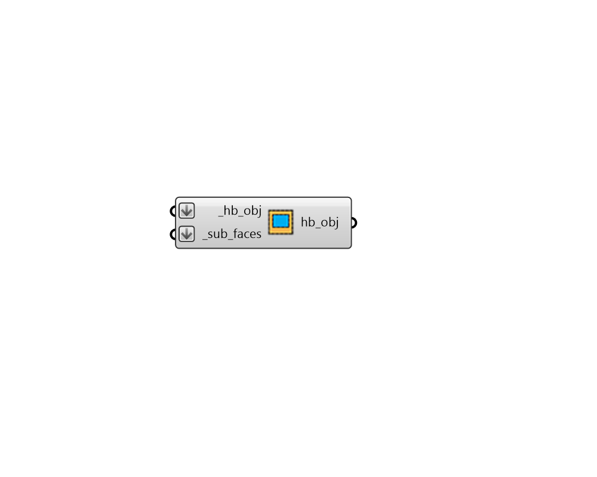

# Add Subface

 - [\[source code\]](https://github.com/ladybug-tools/honeybee-grasshopper-core/blob/master/honeybee_grasshopper_core/src//HB%20Add%20Subface.py)

Add a Honeybee Aperture or Door to a parent Face or Room.

## Inputs

* **hb\_obj \[Required\]**

  A Honeybee Face or a Room to which the \_sub\_faces should be added. 

* **sub\_faces \[Required\]**

  A list of Honeybee Apertures and/or Doors that will be added to the input \_hb\_obj. 

## Outputs

* **hb\_obj**

  The input Honeybee Face or a Room with the input \_sub\_faces added to it. 

