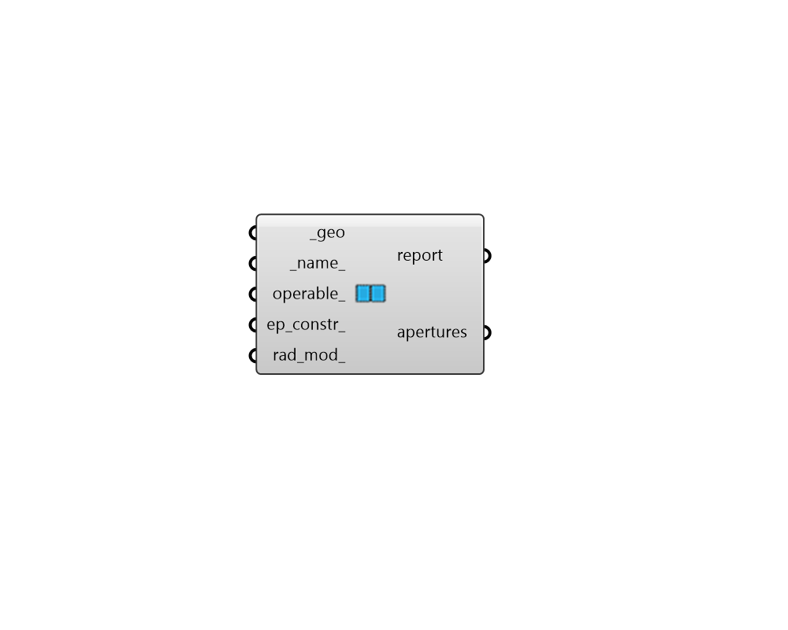

# Aperture

 - [\[source code\]](https://github.com/ladybug-tools/honeybee-grasshopper-core/blob/master/honeybee_grasshopper_core/src//HB%20Aperture.py)

Create Honeybee Aperture

## Inputs

* **geo \[Required\]**

  Rhino Brep or Mesh geometry. 

* **name**

  Text to set the name for the Aperture and to be incorporated into unique Aperture identifier. If the name is not provided, a random name will be assigned. 

* **operable**

  Boolean to note whether the Aperture can be opened for ventilation. 

* **ep\_constr**

  Optional text for the Aperture's energy construction to be looked up in the construction library. This can also be a custom WindowConstruction object. If no energy construction is input here, a default will be assigned based on the properties of the parent face that the Aperture is assigned to \(ie. whether the Face is a RoofCeiling, whether it has a Surface boundary condition, etc.\) 

* **rad\_mod**

  Optional text for the Aperture's radiance modifier to be looked up in the modifier library. This can also be a custom modifier object. If no radiance modifier is input here, a default will be assigned based on the properties of the parent face that the Aperture is assigned to \(ie. whether the Face is a RoofCeiling, whether it has a Surface boundary condition, etc.\) 

## Outputs

* **report**

  Reports, errors, warnings, etc. 

* **apertures**

  Honeybee apertures. These can be used directly in radiance simulations or can be added to a Honeybee face for energy simulation. 

