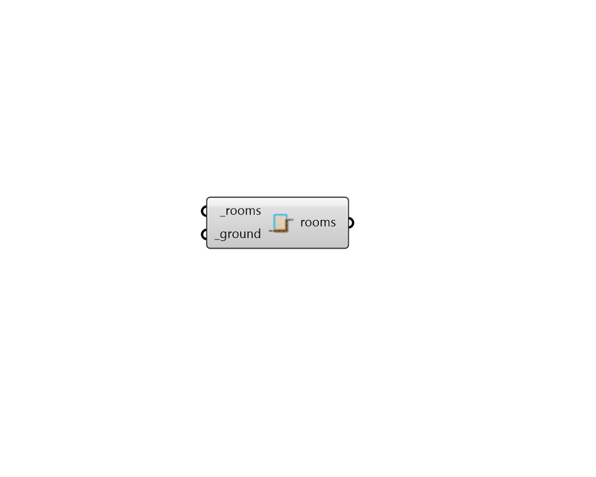

# Custom Ground

 - [\[source code\]](https://github.com/ladybug-tools/honeybee-grasshopper-core/blob/master/honeybee_grasshopper_core/src//HB%20Custom%20Ground.py)

Set the boundary conditions of Rooms to be Ground vs. Outdoors using a surface or polysurface that represents the ground.

Room faces that are coplanar with the ground surface or have a center below it will get a Ground boundary condition. Existing Faces with a Surface/Adiabatic condition, AirBoundary type, or assigned Apertures/Doors will be unaffected.

Note that this component will not intersect the Faces with the ground surface and this is intersection should be done prior to the creation of the Honeybee Rooms.

## Inputs

* **rooms \[Required\]**

  Honeybee Rooms which will have their Face boundary conditions set based on their spatial relation to the \_ground geometry below. 

* **ground \[Required\]**

  Rhino Breps or Meshes that represent the Ground. 

## Outputs

* **rooms**

  The input Rooms with their Ground boundary conditions set. 

