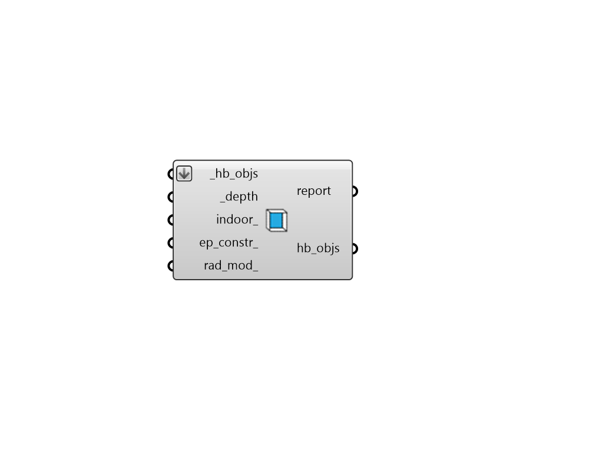

# Extruded Border Shades

 - [\[source code\]](https://github.com/ladybug-tools/honeybee-grasshopper-core/blob/master/honeybee_grasshopper_core/src//HB%20Extruded%20Border%20Shades.py)

Add extruded border Shades to all the outdoor Apertures of an input Room, Face or Aperture.

This is particularly useful for accounting for the depths of walls/roofs in Radiance simulations or in the solar distribution calculation of EnergyPlus.

## Inputs

* **hb\_objs \[Required\]**

  A list of honeybee Rooms, Faces, or Apertures to which extruded border shades will be added. 

* **depth \[Required\]**

  A number for the extrusion depth. 

* **indoor**

  Boolean for whether the extrusion should be generated facing the opposite direction of the aperture normal and added to the Aperture's indoor\_shades instead of outdoor\_shades. Note that, by default, indoor shades are not used in energy simulations but they are used in all simulations involving Radiance. Default: False. 

* **ep\_constr**

  Optional text for an energy construction to be used for all generated shades. This text will be used to look up a construction in the shade construction library. This can also be a custom ShadeConstruction object. 

* **rad\_mod**

  Optional text for a radiance modifier to be used for all generated shades. This text will be used to look up a modifier in the modifier library. This can also be a custom modifier object. 

## Outputs

* **report**

  Reports, errors, warnings, etc. 

* **hb\_objs**

  The input Honeybee Face or Room or Aperture with extruded border shades added to it. 

