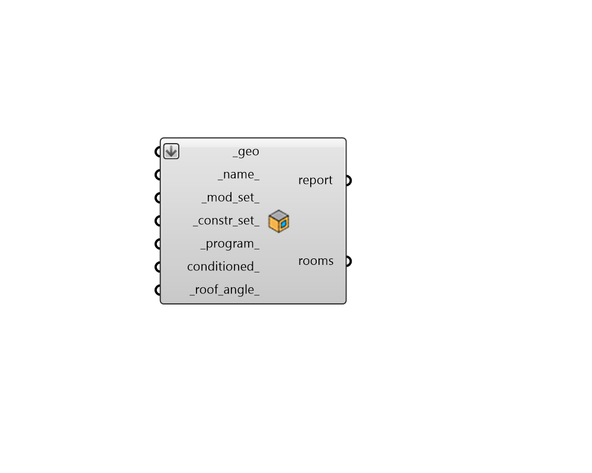

# Room from Solid

 - [\[source code\]](https://github.com/ladybug-tools/honeybee-grasshopper-core/blob/master/honeybee_grasshopper_core/src//HB%20Room%20from%20Solid.py)

Create Honeybee Rooms from solids \(closed Rhino polysurfaces\).

Note that each Room is mapped to a single zone in EnergyPlus/OpenStudio and should always be a closed volume to ensure correct volumetric calculations and avoid light leaks in Radiance simulations.

## Inputs

* **geo \[Required\]**

  A list of closed Rhino polysurfaces \(aka.breps\) to be converted into honeybee Rooms. This list can also include closed meshes that represent the rooms. 

* **name**

  Text to set the base name for the Room, which will also be incorporated into unique Room identifier. If the name is not provided, a random name will be assigned. 

* **mod\_set**

  Text for the modifier set of the Rooms, which is used to assign all default radiance modifiers needed to create a radiance model. Text should refer to a ModifierSet within the library\) such as that output from the "HB List Modifier Sets" component. This can also be a custom ModifierSet object. If nothing is input here, the Room will have a generic construction set that is not sensitive to the Room's climate or building energy code. 

* **constr\_set**

  Text for the construction set of the Rooms, which is used to assign all default energy constructions needed to create an energy model. Text should refer to a ConstructionSet within the library such as that output from the "HB List Construction Sets" component. This can also be a custom ConstructionSet object. If nothing is input here, the Rooms will have a generic construction set that is not sensitive to the Rooms's climate or building energy code. 

* **program**

  Text for the program of the Rooms \(to be looked up in the ProgramType library\) such as that output from the "HB List Programs" component. This can also be a custom ProgramType object. If no program is input here, the Rooms will have a generic office program. Note that ProgramTypes effectively map to OpenStudio space types upon export to OpenStudio. 

* **conditioned**

  Boolean to note whether the Rooms have heating and cooling systems. 

* **roof\_angle**

  Cutting angle for roof from Z axis in degrees. Default: 30. 

## Outputs

* **report**

  Reports, errors, warnings, etc. 

* **rooms**

  Honeybee rooms. These can be used directly in energy and radiance simulations. 

