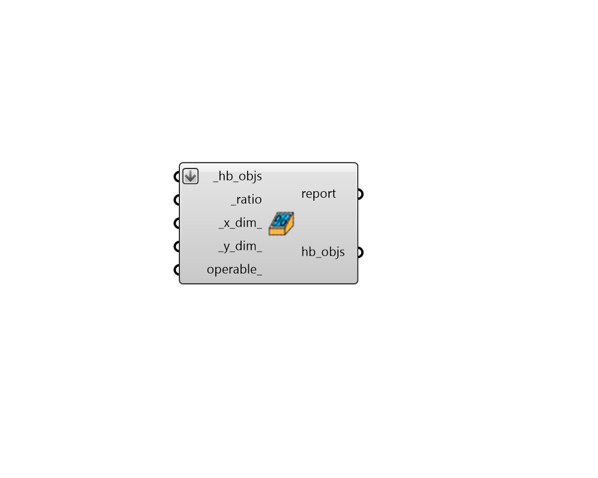

# Skylights by Ratio

 - [\[source code\]](https://github.com/ladybug-tools/honeybee-grasshopper-core/blob/master/honeybee_grasshopper_core/src//HB%20Skylights%20by%20Ratio.py)

Add skylight apertures to a Honeybee Face or Room given a ratio of aperture area to face area.

Note that this component will only add Apertures to Faces that are Roofs and have an Outdoors boundary condition.

## Inputs

* **hb\_objs \[Required\]**

  A list of honeybee Rooms or Faces to which skylight Apertures will be added based on the inputs. 

* **ratio \[Required\]**

  A number between 0 and 1 for the ratio between the area of the apertures and the area of the parent face. 

* **x\_dim**

  The x dimension of the grid cells as a number. \(Default: 3 meters\) 

* **y\_dim**

  The y dimension of the grid cells as a number. Default is None, which will assume the same cell dimension for y as is set for x. 

* **operable**

  An optional boolean to note whether the generated Apertures can be opened for ventilation. Default: False. 

## Outputs

* **report**

  Reports, errors, warnings, etc. 

* **hb\_objs**

  The input Honeybee Face or Room with skylight Apertures generated from the input parameters. 

