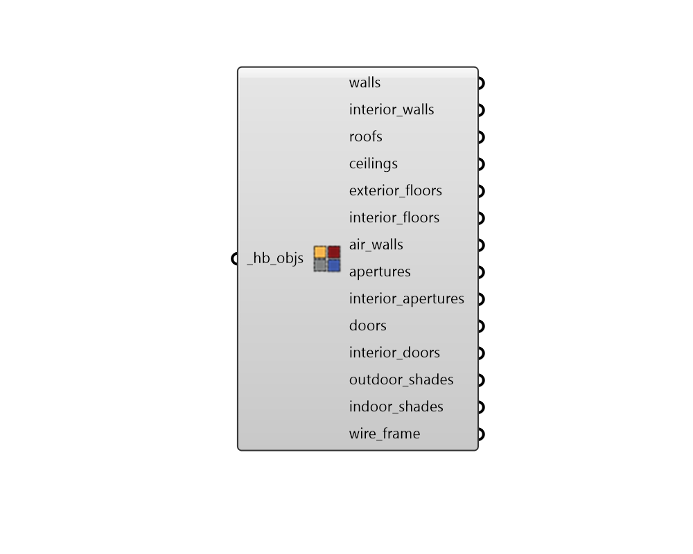

# Visualize by Type

 - [\[source code\]](https://github.com/ladybug-tools/honeybee-grasshopper-core/blob/master/honeybee_grasshopper_core/src//HB%20Visualize%20by%20Type.py)

Visualize room geometry in the Rhino scene organized by object and face type.

## Inputs

* **hb\_objs \[Required\]**

  A Honeybee Model, Room, Face, Aperture, Door or Shade to be previewed in the Rhino scene based on type. 

## Outputs

* **walls**

  Rhino geometry for the Walls with an Outdoors or Ground boundary condition. 

* **interior\_walls**

  Rhino geometry for the Walls with a Surface or Adiabatic boundary condition. 

* **roofs**

  Rhino geometry for the RoofCeilings with an Outdoors or Ground boundary condition. 

* **ceilings**

  Rhino geometry for the RoofCeilings with a Surface or Adiabatic boundary condition. 

* **exterior\_floors**

  Rhino geometry for the Floors with an Outdoors or Ground boundary condition. 

* **interior\_floors**

  Rhino geometry for the Floors with a Surface or Adiabatic boundary condition. 

* **air\_walls**

  Rhino geometry for the AirWalls. 

* **apertures**

  Rhino geometry for the Apertures with an Outdoors boundary condition. 

* **interior\_apertures**

  Rhino geometry for the Apertures with a Surface boundary condition. 

* **doors**

  Rhino geometry for the Doors with an Outdoors boundary condition. 

* **interior\_doors**

  Rhino geometry for the Doors with a Surface boundary condition. 

* **outdoor\_shades**

  Rhino geometry for the Shades assigned to the outdoors of their parent objects. This also includes all orphaned shades of a model. 

* **indoor\_shades**

  Rhino geometry for the Shades assigned to the indoors of their parent objects. 

* **wire\_frame**

  A list of lines representing the outlines of the rooms. 

