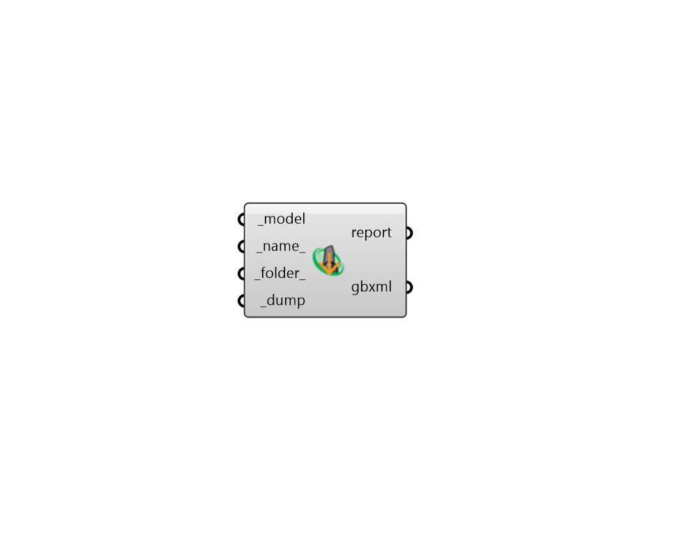

# Dump gbXML

 - [\[source code\]](https://github.com/ladybug-tools/honeybee-grasshopper-core/blob/master/honeybee_grasshopper_core/src//HB%20Dump%20gbXML.py)

Dump a Honyebee Model to a gbXML file.

The gbXML format is a common open standard used to transfer energy model geometry and \(some\) energy simulation properties from one simulation environment to another.

The forward translators within the OpenStudio SDK are used to export all Honeybee model geometry and properties.

## Inputs

* **model \[Required\]**

  A Honeybee Model object to be written to a gbXML file. 

* **name**

  A name for the file to which the honeybee objects will be written. \(Default: 'unnamed'\). 

* **folder**

  An optional directory into which the honeybee objects will be written.  The default is set to the default simulation folder. 

* **dump \[Required\]**

  Set to "True" to save the honeybee model to a gbXML file. 

## Outputs

* **report**

  Errors, warnings, etc. 

* **gbxml**

  The location of the file where the honeybee JSON is saved. 

