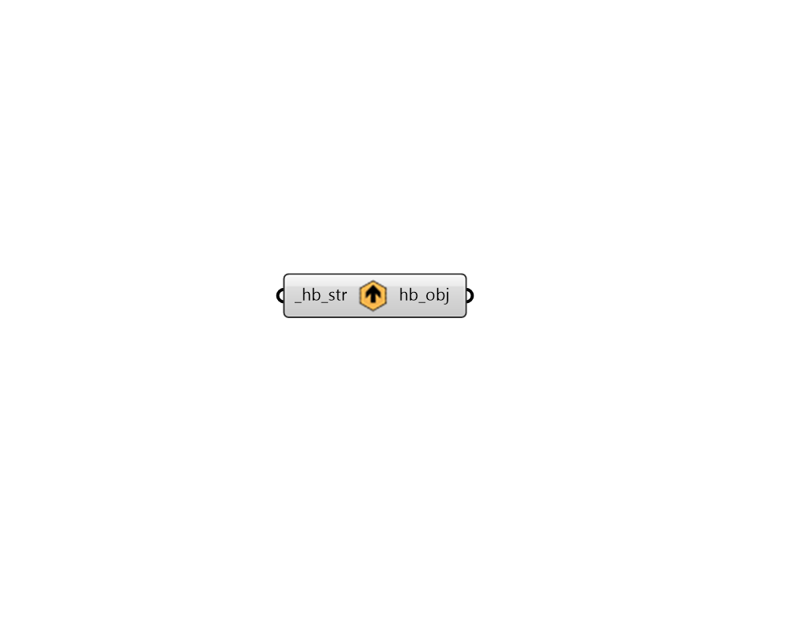

# String to Object

 - [\[source code\]](https://github.com/ladybug-tools/honeybee-grasshopper-core/blob/master/honeybee_grasshopper_core/src//HB%20String%20to%20Object.py)

Serialize any honeybee JSON text string back to a honeybee object.

Honeybee objects include any Model, Room, Face, Aperture, Door, Shade, or boundary condition object.

It also includes any honeybee energy Material, Construction, ConstructionSet, Schedule, Load, ProgramType, or Simulation object.

## Inputs

* **hb\_str \[Required\]**

  A text string that completely describes the honeybee object. 

## Outputs

* **hb\_obj**

  A Honeybee object serialized from the input string. 

