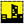

#### Component list:
*  [Honeybee_Surface](../components/Honeybee_Surface.md)
*  [Honeybee_Window_Group](../components/Honeybee_Window_Group.md)
*  [Honeybee_Window_Surface](../components/Honeybee_Window_Surface.md)
*  [Analysis_Grid](../components/Analysis_Grid.md)
*  [WindowGroup_State](../components/WindowGroup_State.md)
*  [Occupancy_Schedule](../components/Occupancy_Schedule.md)
*  [Occupancy_Schedule_from_Week](../components/Occupancy_Schedule_from_Week.md)
*  [Radiance_Scene](../components/Radiance_Scene.md)
*  [View](../components/View.md)
*  [Write_HBObjects_to_Radiance](../components/Write_HBObjects_to_Radiance.md)