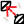

#### Component list:
*  [Deconstruct Model](../components/Deconstruct_Model.md)
*  [Model](../components/Model.md)
*  [Deconstruct Object](../components/Deconstruct_Object.md)
*  [Intersect Solids](../components/Intersect_Solids.md)
*  [Planarize Brep](../components/Planarize_Brep.md)
*  [Room](../components/Room.md)
*  [Room from Solid](../components/Room_from_Solid.md)
*  [Solve Adjacency](../components/Solve_Adjacency.md)
*  [Face](../components/Face.md)
*  [Properties by Guide Surface](../components/Properties_by_Guide_Surface.md)
*  [Add Subface](../components/Add_Subface.md)
*  [Aperture](../components/Aperture.md)
*  [Apertures by Ratio](../components/Apertures_by_Ratio.md)
*  [Door](../components/Door.md)
*  [Facade Parameters](../components/Facade_Parameters.md)
*  [Skylights by Ratio](../components/Skylights_by_Ratio.md)
*  [Add Shade](../components/Add_Shade.md)
*  [Extruded Border Shades](../components/Extruded_Border_Shades.md)
*  [Louver Shades](../components/Louver_Shades.md)
*  [Shade](../components/Shade.md)
*  [Mirror](../components/Mirror.md)
*  [Move](../components/Move.md)
*  [Rotate](../components/Rotate.md)
*  [Scale](../components/Scale.md)
*  [Recipe Settings](../components/Recipe_Settings.md)
*  [Add Prefix](../components/Add_Prefix.md)
*  [Custom Ground](../components/Custom_Ground.md)
*  [Set Identifier](../components/Set_Identifier.md)
*  [Set Multiplier](../components/Set_Multiplier.md)
*  [Set Story](../components/Set_Story.md)