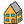

#### Component list:
*  [Visualize All](../components/Visualize_All.md)
*  [Visualize Normals](../components/Visualize_Normals.md)
*  [Visualize Quick](../components/Visualize_Quick.md)
*  [Visualize Wireframe](../components/Visualize_Wireframe.md)
*  [Face Attributes](../components/Face_Attributes.md)
*  [Room Attributes](../components/Room_Attributes.md)
*  [Color Face Attributes](../components/Color_Face_Attributes.md)
*  [Color Room Attributes](../components/Color_Room_Attributes.md)
*  [Label Faces](../components/Label_Faces.md)
*  [Label Rooms](../components/Label_Rooms.md)
*  [Visualize by BC](../components/Visualize_by_BC.md)
*  [Visualize by Type](../components/Visualize_by_Type.md)
*  [Check Versions](../components/Check_Versions.md)
*  [Config](../components/Config.md)