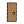
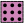
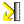

#### Component list:
*  [Pollination Model](../components/Pollination_Model.md)
*  [Pollination Orphaned Aperture](../components/Pollination_Orphaned_Aperture.md)
*  [Pollination Orphaned Door](../components/Pollination_Orphaned_Door.md)
*  [Pollination Orphaned Shade](../components/Pollination_Orphaned_Shade.md)
*  [Pollination Room](../components/Pollination_Room.md)
*  [Pollination SensorGrid](../components/Pollination_SensorGrid.md)
*  [Pollination Construction](../components/Pollination_Construction.md)
*  [Pollination ConstructionSet](../components/Pollination_ConstructionSet.md)
*  [Pollination Material](../components/Pollination_Material.md)
*  [Pollination Modifier](../components/Pollination_Modifier.md)
*  [Pollination Modifier Set](../components/Pollination_Modifier_Set.md)
*  [Pollination ProgramType](../components/Pollination_ProgramType.md)
*  [Pollination Schedule](../components/Pollination_Schedule.md)