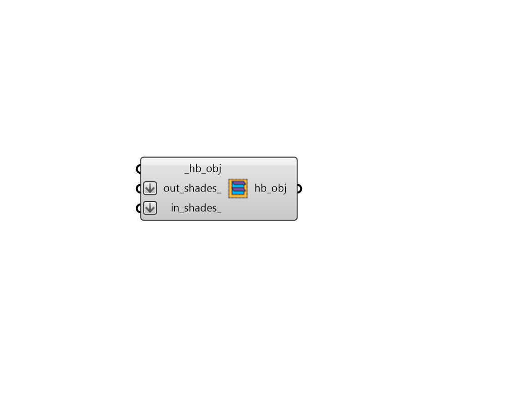

## Add Shade

 - [[source code]](https://github.com/ladybug-tools/honeybee-grasshopper-core/blob/master/ladybug_grasshopper/src//HB%20Add%20Shade.py)

Add a Honeybee Shades to an Aperture, Door, Face or Room. 

#### Inputs
* ##### hb_obj [Required]
A Honeybee Aperture, Door, Face or a Room to which the shades should be added. 
* ##### out_shades 
A list of Honeybee Shade objects to be added to the outside of the input _hb_objs. 
* ##### in_shades 
A list of Honeybee Shade objects to be added to the inside of the input _hb_objs. Note that, by default, indoor shades are not used in energy simulations but they are used in all simulations involving Radiance. 

#### Outputs
* ##### hb_obj
The input Honeybee Aperture, Face or a Room with the input shades added to it. 