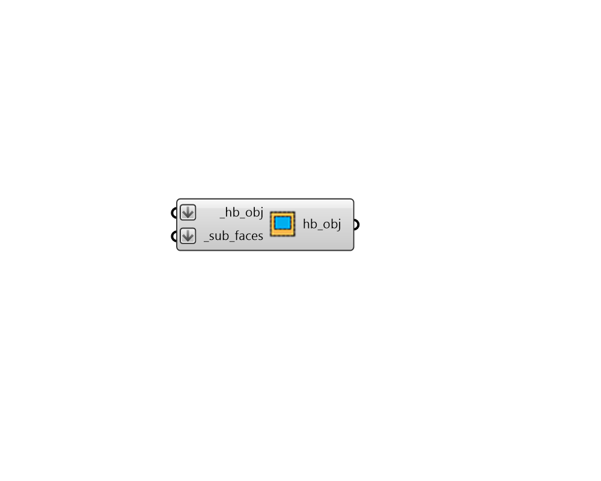

## Add Subface

 - [[source code]](https://github.com/ladybug-tools/honeybee-grasshopper-core/blob/master/ladybug_grasshopper/src//HB%20Add%20Subface.py)

Add a Honeybee Aperture or Door to a parent Face or Room. 

#### Inputs
* ##### hb_obj [Required]
A Honeybee Face or a Room to which the _sub_faces should be added. 
* ##### sub_faces [Required]
A list of Honeybee Apertures and/or Doors that will be added to the input _hb_obj. 

#### Outputs
* ##### hb_obj
The input Honeybee Face or a Room with the input _sub_faces added to it. 