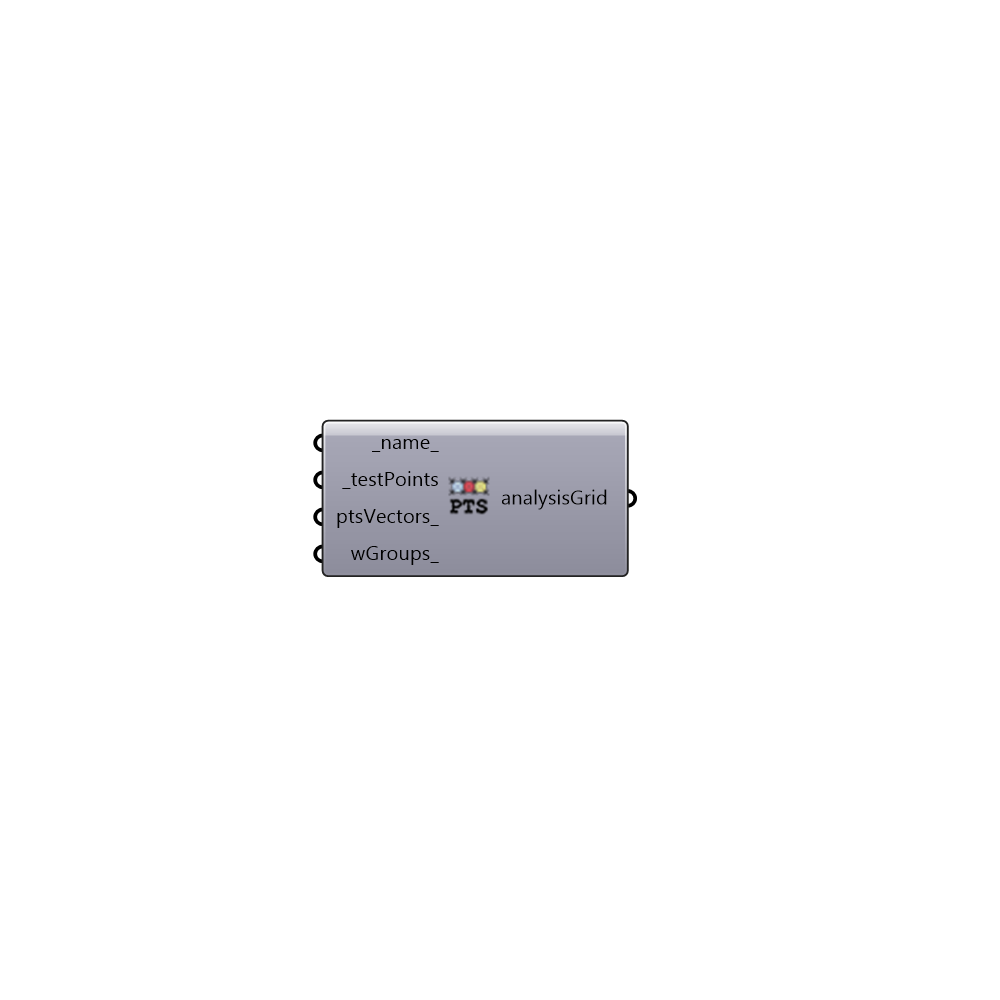

##  Analysis Grid

Analysis Grid.
 -

#### Inputs
* ##### name [Default]
A name for this analysis grid.
* ##### testPoints [Required]
A list or a datatree of points. Each branch of the datatree
 will be considered as a point group.
* ##### ptsVectors [Optional]
A list or a datatree of vectors. Each vector represents the
 direction of the respective test point in testPoints. If only one
 value is provided it will be used for all the test points. If no value
 is provided (0, 0, 1) will be assigned for all the vectors.
* ##### wGroups [Optional]
An optional list of window groups. This input is only
 important for multi-phase daylight simulation to avoid unnecessary
 view matrix calculations. If this input is left empty for multi-phase
 daylight recipes the view matrix will be calculated for each analysis
 grid and every window group.

#### Outputs
* ##### analysisGrid
Analysis grid. Use this analysis grid to create a grid-based
 analysis.

[Check Hydra Example Files for Analysis Grid](https://hydrashare.github.io/hydra/index.html?keywords=HoneybeePlus_Analysis Grid)