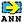
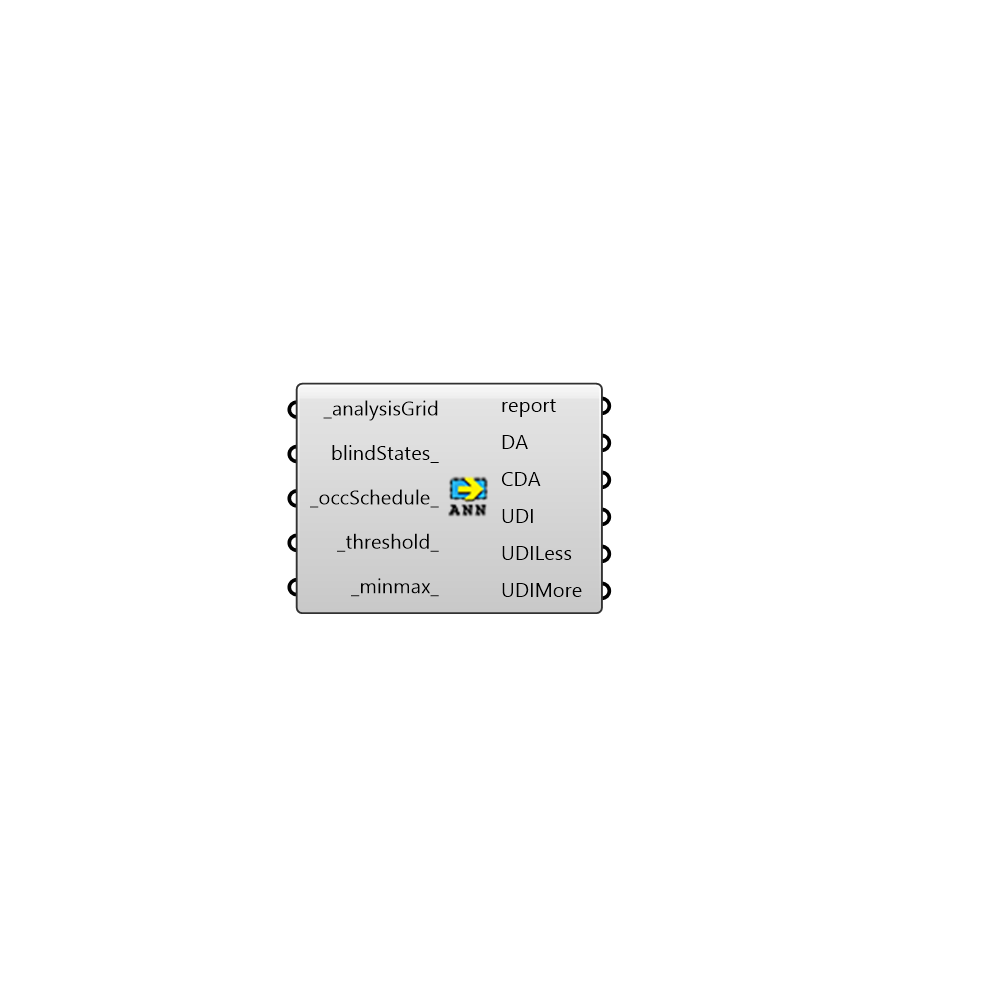

##  Annual Daylight Metrics - [[source code]](https://github.com/ladybug-tools/honeybee-grasshopper/tree/master/plugin/grasshopper/src/HoneybeePlus_Annual%20Daylight%20Metrics.py)

Annual Daylight Metrics
 -

#### Inputs
* ##### analysisGrid [Required]
An analysis grid output from run Radiance analysis.
* ##### blindStates [Optional]
List of state ids for all the sources for input hoys.
 If you want a source to be removed set the state to -1. You can use
 this option to study the effect of different blind states.
* ##### occSchedule [Default]
An annual occupancy schedule.
* ##### threshold [Default]
Threshhold for daylight autonomy in lux (default: 300).
* ##### minmax [Default]
A list for min, max value for useful daylight illuminance

#### Outputs
* ##### report
The execution information, as output and error streams
* ##### DA
Daylight autonomy. The percentage of time that each sensor
 recieves equal or more than the threshold.
* ##### CDA
Continuous daylight autonomy.
* ##### UDI
Useful daylight illuminance. The percentage of time that illuminace
 falls between minimum and maximum thresholds.
* ##### UDILess
The percentage of time that illuminace falls less than minimum
 threshold.
* ##### UDIMore
The percentage of time that illuminace falls more than maximum
 threshold.
* ##### legendPar
Script variable annualMetrics

[Check Hydra Example Files for Annual Daylight Metrics](https://hydrashare.github.io/hydra/index.html?keywords=HoneybeePlus_Annual Daylight Metrics)