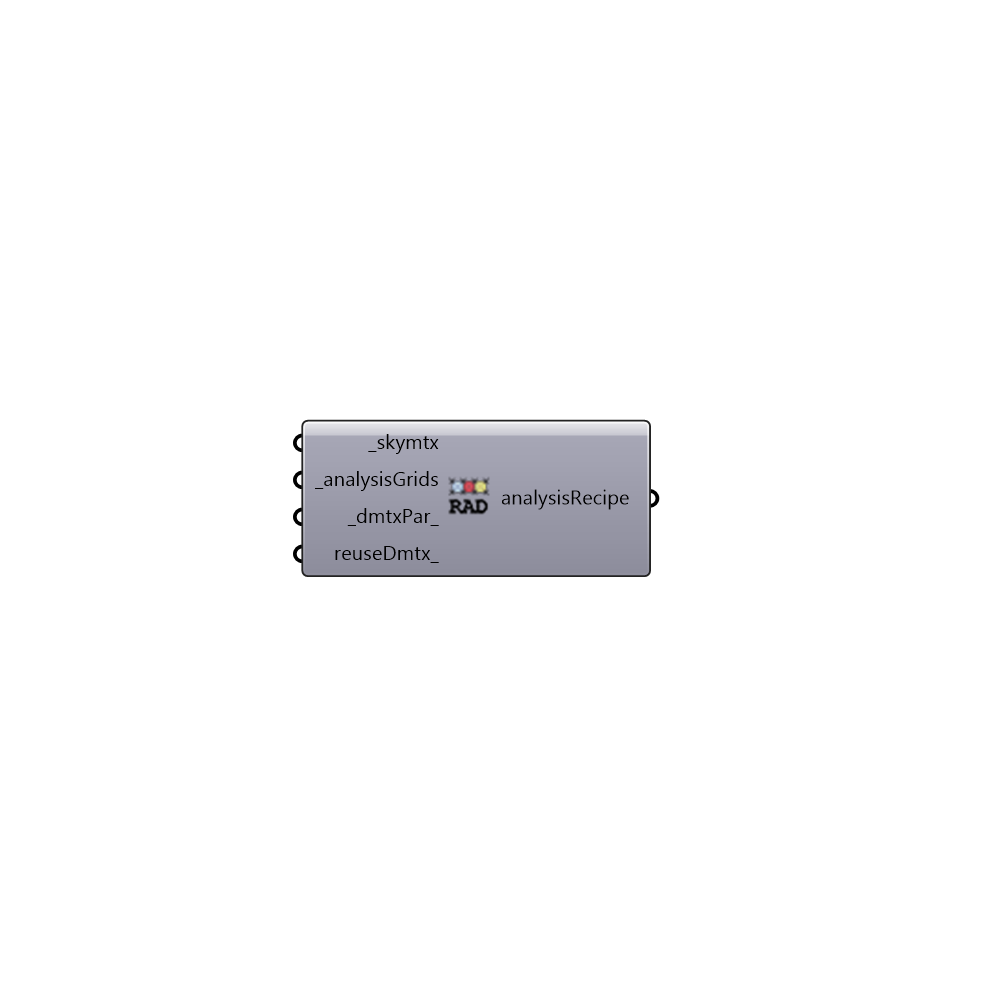

##  Annual Radiation Recipe - [[source code]](https://github.com/ladybug-tools/honeybee-grasshopper/tree/master/plugin/grasshopper/src/HoneybeePlus_Annual%20Radiation%20Recipe.py)

Annual radiation analysis
 -

#### Inputs
* ##### skymtx [Required]
A sky matrix or a sky vector. Find honeybee skies under 02::Daylight::Light Sources.
* ##### analysisGrids [Required]
A list of Honeybee analysis grids.
* ##### dmtxPar [Default]
Radiance parameters for Daylight matrix calculation. Find
 Radiance parameters node under 03::Daylight::Recipe.
* ##### reuseDmtx [Optional]
A boolean to indicate if you want the analysis to use the daylight
 coeff matrix results from the previous study if available.

#### Outputs
* ##### analysisRecipe
Annual analysis recipe. Connect this recipe to Run Radiance
 Analysis to run a annual analysis.

[Check Hydra Example Files for Annual Radiation Recipe](https://hydrashare.github.io/hydra/index.html?keywords=HoneybeePlus_Annual Radiation Recipe)