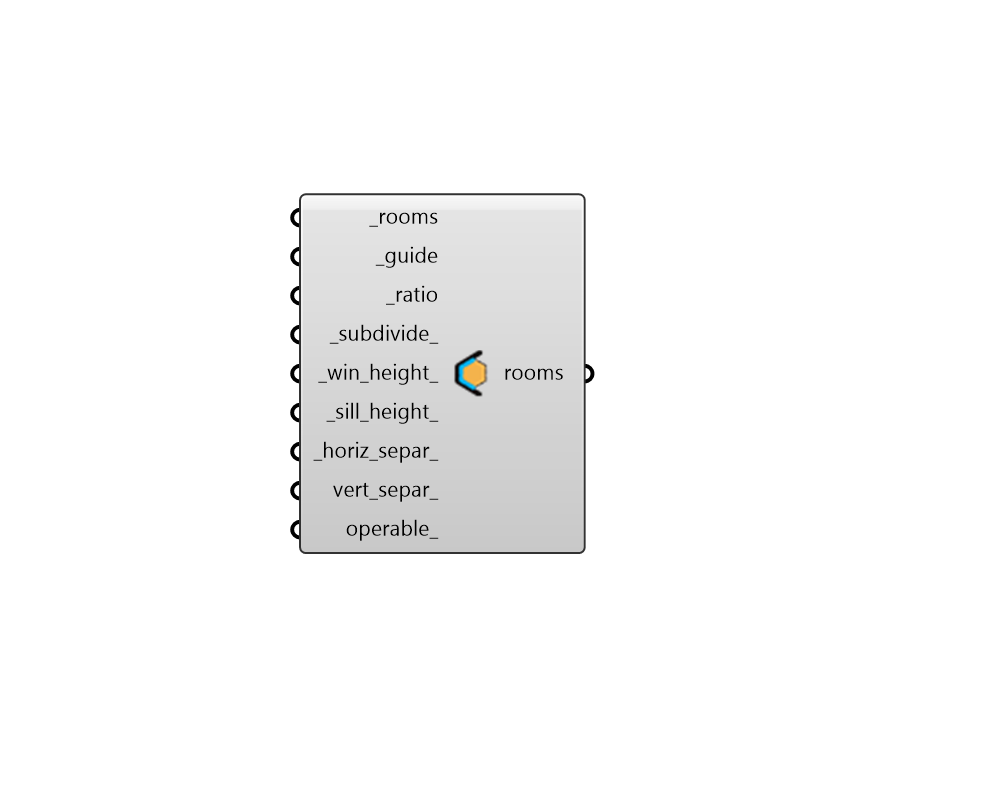

## Apertures by Guide Surface

 - [[source code]](https://github.com/ladybug-tools/honeybee-grasshopper-core/blob/master/honeybee_grasshopper_core/src//HB%20Apertures%20by%20Guide%20Surface.py)

Set the apertures of room Faces using (a) guide surface(s) or polysurface(s). 

Faces that are touching and coplanar with the guide surface will get their aperters changed according to the input properties. 

#### Inputs
* ##### rooms [Required]
Honeybee Rooms which will have their apertures set based on their relation to the guide surface(s). 
* ##### guide [Required]
Rhino Breps or Meshes that represent the guide surfaces. 
* ##### ratio [Required]
A number between 0 and 0.95 for the ratio between the area of the apertures and the area of the parent face. 
* ##### subdivide 
Boolean to note whether to generate a single window in the center of each Face (False) or to generate a series of rectangular windows using the other inputs below (True). The latter is often more realistic and is important to consider for detailed daylight and thermal comfort simulations but the former is likely better when the only concern is building energy use since energy use doesn't change much while the glazing ratio remains constant. (Default: True). 
* ##### win_height 
A number for the target height of the output apertures. Note that, if the ratio is too large for the height, the ratio will take precedence and the actual aperture height will be larger than this value. (Default: 2 meters). 
* ##### sill_height 
A number for the target height above the bottom edge of the face to start the apertures. Note that, if the ratio is too large for the height, the ratio will take precedence and the sill_height will be smaller than this value. If an array of values are input here, different heights will be assigned based on cardinal direction, starting with north and moving clockwise. Default: 0.8 meters. 
* ##### horiz_separ 
A number for the horizontal separation between individual aperture centerlines.  If this number is larger than the parent face's length, only one aperture will be produced. If an array of values are input here, different separation distances will be assigned based on cardinal direction, starting with north and moving clockwise. Default: 3 meters. 
* ##### vert_separ 
An optional number to create a single vertical separation between top and bottom apertures. If an array of values are input here, different separation distances will be assigned based on cardinal direction, starting with north and moving clockwise. 
* ##### operable 
An optional boolean to note whether the generated Apertures can be opened for ventilation. If an array of booleans are input here, different operable properties will be assigned based on cardinal direction, starting with north and moving clockwise. 

#### Outputs
* ##### rooms
The input Rooms with their Face properties changed. 