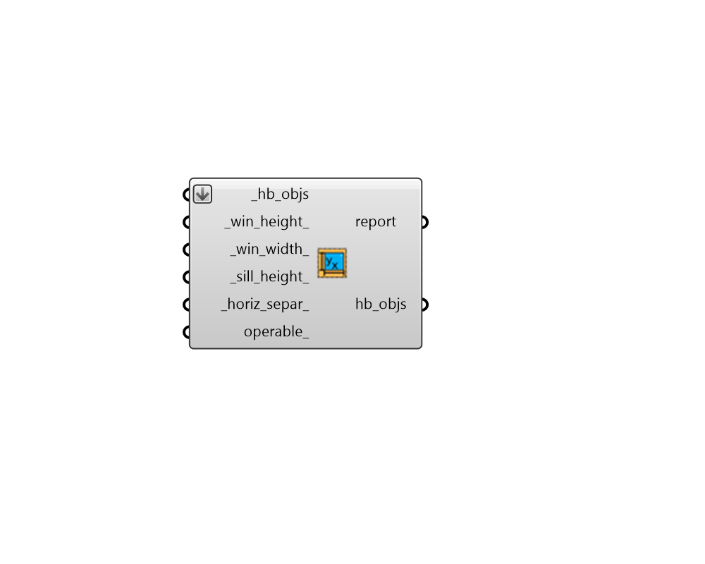
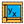

## Apertures by Width Height

 - [[source code]](https://github.com/ladybug-tools/honeybee-grasshopper-core/blob/master/honeybee_grasshopper_core/src//HB%20Apertures%20by%20Width%20Height.py)

Add apertures to a Honeybee Face or Room given a width and a height of windows that repeat across the walls at a specific horizontal separation between window centerlines. 

Note that this component will only add Apertures to Faces that are Walls, have an Outdoors boundary condition, and have at least a portion of the Face that is clearly rectangular. 

#### Inputs
* ##### hb_objs [Required]
A list of honeybee Rooms or Faces to which Apertures will be added based on the inputs. This can also be an entire honeybee Model for which all Rooms will have Apertures assigned. 
* ##### win_height 
A number for the target height of the output apertures. Note that, if the window height is larger than the height of the wall, the generated windows will have a height equal to the wall height in order to avoid having windows extend outside the wall face. If an array of values are input here, different heights will be assigned based on cardinal direction, starting with north and moving clockwise. (Default: 2 meters). 
* ##### win_width 
A number for the target width the output apertures. Note that, if the window width is larger than the width of the wall, the generated windows will have a width equal to the wall width in order to avoid having windows extend outside the wall face. If an array of values are input here, different widths will be assigned based on cardinal direction, starting with north and moving clockwise. (Default: 1.5 meters). 
* ##### sill_height 
A number for the target height above the bottom edge of the face to start the apertures. Note that, if the window height is too large to acoomodate the sill height input here, the window height will take precedence and the sill height will be smaller than this value. If an array of values are input here, different heights will be assigned based on cardinal direction, starting with north and moving clockwise. (Default: 0.8 meters). 
* ##### horiz_separ 
A number for the horizontal separation between individual aperture centerlines.  If this number is larger than the parent face's length, only one aperture will be produced. If an array of values are input here, different separation distances will be assigned based on cardinal direction, starting with north and moving clockwise. (Default: 3 meters). 
* ##### operable 
An optional boolean to note whether the generated Apertures can be opened for ventilation. If an array of booleans are input here, different operable properties will be assigned based on cardinal direction, starting with north and moving clockwise. (Default: False). 

#### Outputs
* ##### report
Reports, errors, warnings, etc. 
* ##### hb_objs
The input Honeybee Face, Room or Model with Apertures generated from the input parameters. 