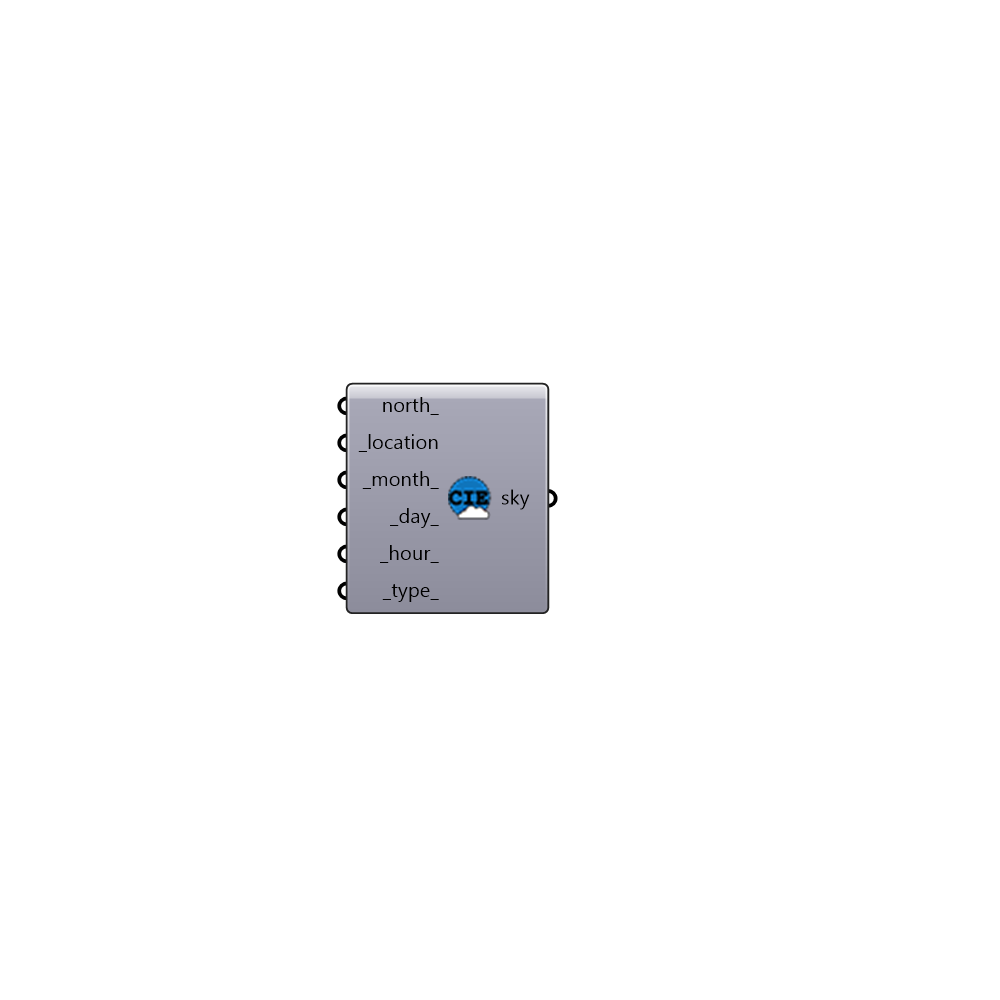

##  CIE Standard Sky - [[source code]](https://github.com/ladybug-tools/honeybee-grasshopper/tree/master/plugin/grasshopper/src/HoneybeePlus_CIE%20Standard%20Sky.py)

Standard Radiance CIE Sky.

#### Inputs
* ##### north [Optional]
A number between 0 and 360 that represents the degrees off from
 the y-axis to make North. The default North direction is set to the
 Y-axis (default: 0 degrees).
* ##### location [Required]
A Ladybug location.
* ##### month [Default]
Input a number to indicate month (1..12) (default: 6).
* ##### day [Default]
Input a number to indicate day (1..31) (default: 21).
* ##### hour [Default]
Input a number to indicate hour (0..23) (default: 12).
* ##### type [Default]
An integer between 0..5 to indicate CIE Sky Type (default: 0).
 [0] Sunny with sun, [1] sunny without sun, [2] intermediate with sun
 [3] intermediate without sun, [4] cloudy sky, [5] uniform sky (default: 0)

#### Outputs
* ##### sky
Honeybee sky. You can use this sky to create a grid-based daylight
 recipe.

[Check Hydra Example Files for CIE Standard Sky](https://hydrashare.github.io/hydra/index.html?keywords=HoneybeePlus_CIE Standard Sky)