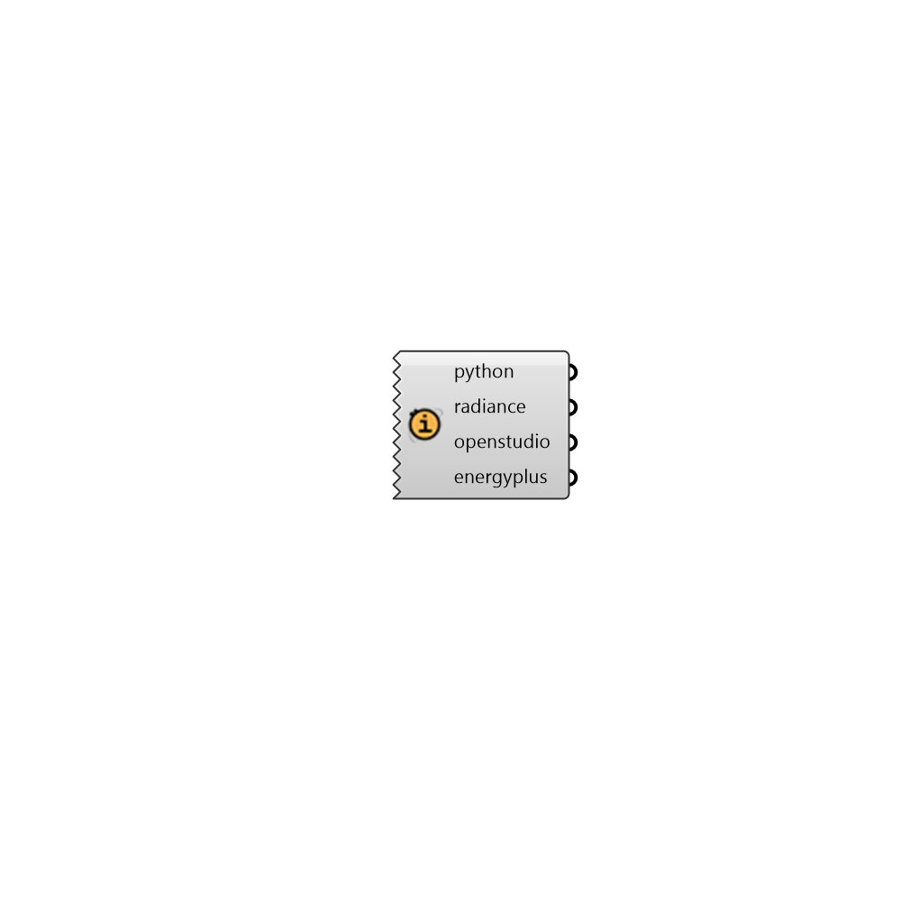

## Check Versions

 - [[source code]](https://github.com/ladybug-tools/honeybee-grasshopper-core/blob/master/ladybug_grasshopper/src//HB%20Check%20Versions.py)

Check the versions of the engines that are being used by the honeybee plugin. This is useful for verifying that everything has been installed correctly and that the versions of the engines are as expected. 

#### Inputs

#### Outputs
* ##### python
The version of Python used for Ladybug Tools CLI calls. 
* ##### radiance
The version of Radiance if it is installed. 
* ##### openstudio
The version of OpenStudio if it is installed. 
* ##### energyplus
The version of EnergyPlus if it is installed. 