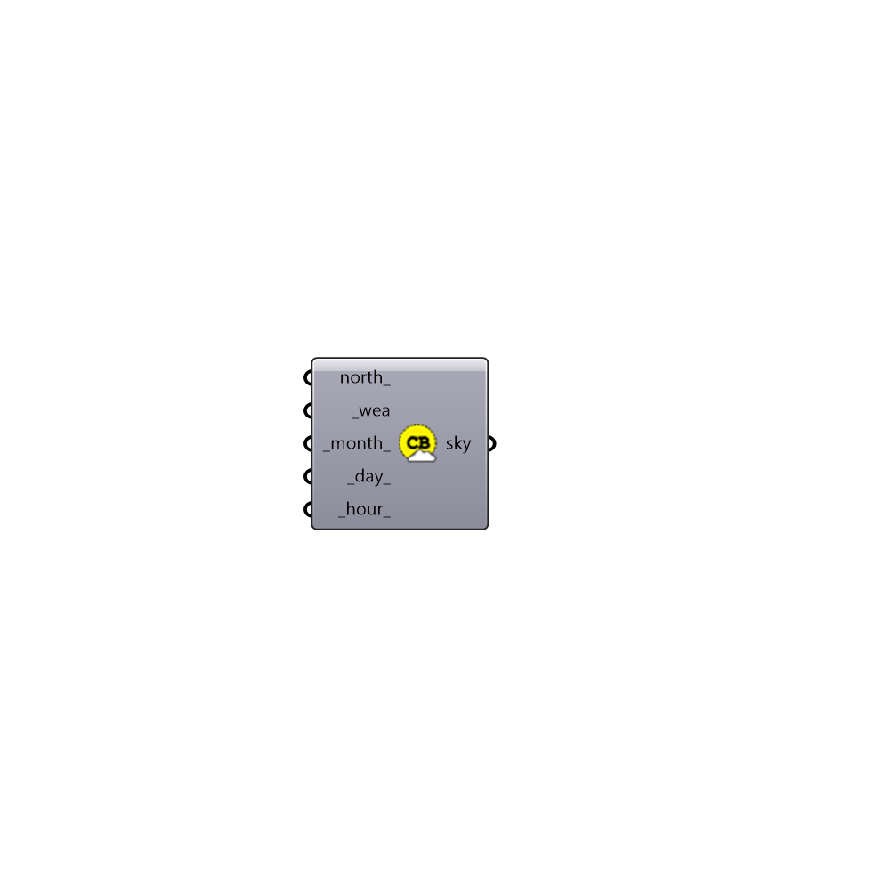

##  Climatebased Sky

Climate-based Sky.

#### Inputs
* ##### north [Optional]
A number between 0 and 360 that represents the degrees off from
 the y-axis to make North. The default North direction is set to the
 Y-axis (default: 0 degrees).
* ##### wea [Required]
A Ladybug wea.
* ##### month [Default]
Input a number to indicate month (1..12) (default: 6).
* ##### day [Default]
Input a number to indicate day (1..31) (default: 21).
* ##### hour [Default]
Input a number to indicate hour (0..23) (default: 12).

#### Outputs
* ##### sky
Honeybee sky. You can use this sky to create a daylight recipe.

[Check Hydra Example Files for Climatebased Sky](https://hydrashare.github.io/hydra/index.html?keywords=HoneybeePlus_Climatebased Sky)