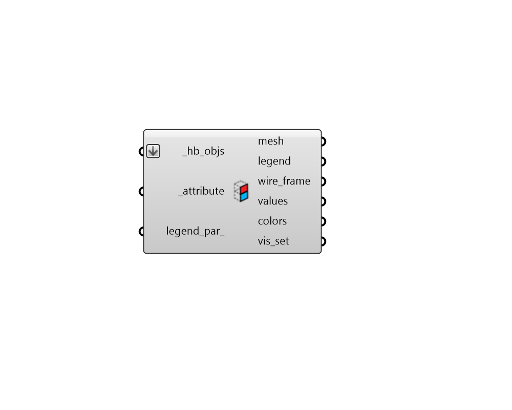

## Color Face Attributes

 - [[source code]](https://github.com/ladybug-tools/honeybee-grasshopper-core/blob/master/honeybee_grasshopper_core/src//HB%20Color%20Face%20Attributes.py)

Color Honeybee Faces, Apertures, Doors and Shades in the Rhino scene using their attributes. 

This can be used as a means to check that correct properties are assigned to different faces. 

#### Inputs
* ##### hb_objs [Required]
An array of honeybee Rooms, Faces, Apertures, Doors or Shades to be colored with their attributes in the Rhino scene. This can also be an entire Model to be colored. 
* ##### attribute [Required]
Text for the name of the attribute with which the faces or sub-faces should be labeled. The Honeybee "Face Attributes" component lists all of the core attributes of the room. Also, each Honeybee extension (ie. Radiance, Energy) includes its own component that lists the face and sub-face attributes of that extension. 
* ##### legend_par 
An optional LegendParameter object to change the display of the colored faces and sub-faces (Default: None). 

#### Outputs
* ##### mesh
Meshes of the faces and sub-faces colored according to their attributes. 
* ##### legend
Geometry representing the legend for colored meshes. 
* ##### wire_frame
A list of lines representing the outlines of the _hb_objs. 
* ##### values
A list of values noting the attribute assigned to each face/sub-face. 
* ##### colors
A list of colors noting the color of each face/sub-face in the Rhino scene. This can be used in conjunction with the native Grasshopper "Custom Preview" component to create custom visualizations in the Rhino scene. 
* ##### vis_set
An object containing VisualizationSet arguments for drawing a detailed version of the ColorRoom in the Rhino scene. This can be connected to the "LB Preview Visualization Set" component to display this version of the visualization in Rhino. 