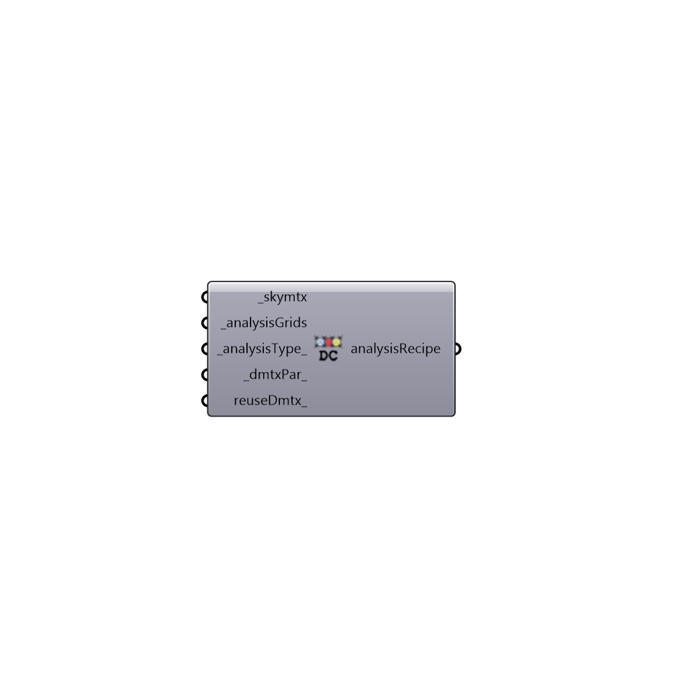

##  DC Grid-based Daylight Recipe

Daylight Coefficient Grid-based Daylight Recipe.
 Use this recipe to set up annual daylight analysis.
 -

#### Inputs
* ##### skymtx [Required]
A sky matrix or a sky vector. Find honeybee skies under 02::Daylight::Light Sources.
* ##### analysisGrids [Required]
A list of Honeybee analysis grids.
* ##### analysisType [Default]
Analysis type. [0] illuminance(lux), [1] radiation (kwh),
 [2] luminance (Candela).
* ##### radiancePar [Default]
Radiance parameters for Grid-based analysis. Find Radiance
 parameters node under 03::Daylight::Recipes.
* ##### reuseDmtx [Optional]
A boolean to indicate if you want the analysis to use the daylight
 coeff matrix results from the previous study if available.

#### Outputs
* ##### analysisRecipe
Annual analysis recipe. Connect this recipe to Run Radiance
 Analysis to run a annual analysis.

[Check Hydra Example Files for DC Grid-based Daylight Recipe](https://hydrashare.github.io/hydra/index.html?keywords=HoneybeePlus_DC Grid-based Daylight Recipe)