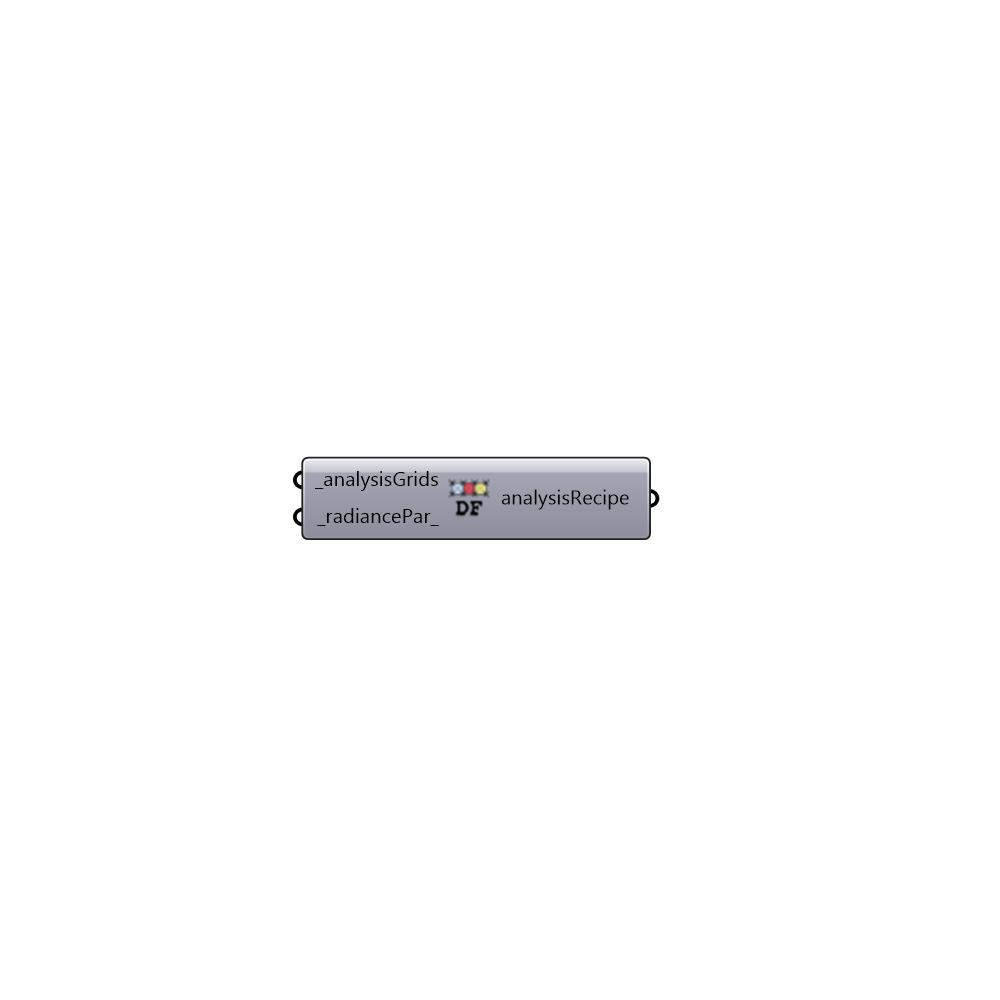

##  Daylight Factor Recipe - [[source code]](https://github.com/ladybug-tools/honeybee-grasshopper/tree/master/plugin/grasshopper/src/HoneybeePlus_Daylight%20Factor%20Recipe.py)

Daylight factor Recipe.
 -

#### Inputs
* ##### analysisGrids [Required]
A list list of analysis grids.
* ##### radiancePar [Default]
Radiance parameters for Grid-based analysis. Find Radiance
 parameters node under 03::Daylight::Recipes.

#### Outputs
* ##### analysisRecipe
Daylight factor analysis recipe. Connect this recipe to
 Run Radiance Analysis to run a grid-based analysis.

[Check Hydra Example Files for Daylight Factor Recipe](https://hydrashare.github.io/hydra/index.html?keywords=HoneybeePlus_Daylight Factor Recipe)