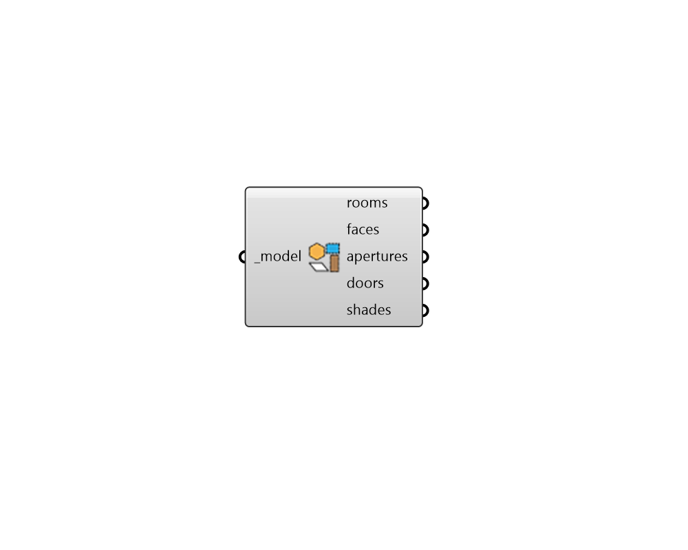

## Deconstruct Model

 - [[source code]](https://github.com/ladybug-tools/honeybee-grasshopper-core/blob/master/honeybee_grasshopper_core/src//HB%20Deconstruct%20Model.py)

Deconstruct a Honeybee Model object into all of its constituent Honeybee objects. 

#### Inputs
* ##### model [Required]
A Honeybee Model to be deconstructed into into its constituent objects (Rooms, Faces, Apertures, Doors Shades). 

#### Outputs
* ##### rooms
All of the Room objects contained within the input Model. 
* ##### faces
All of the orphaned Face objects within the input Model. This only oncludes parent-less Faces and does not include any Faces that belong to a Room. 
* ##### apertures
All of the orphaned Aperture objects within the input Model. This only oncludes parent-less Apertures and does not include any Apertures that belong to a Face. 
* ##### doors
All of the orphaned Door objects within the input Model. This only oncludes parent-less Doors and does not include any Doors that belong to a Face. 
* ##### shades
All of the orphaned Shade objects within the input Model. This only oncludes parent-less Shades and does not include any Shades that belong to an Aperture, Face, or Room. 