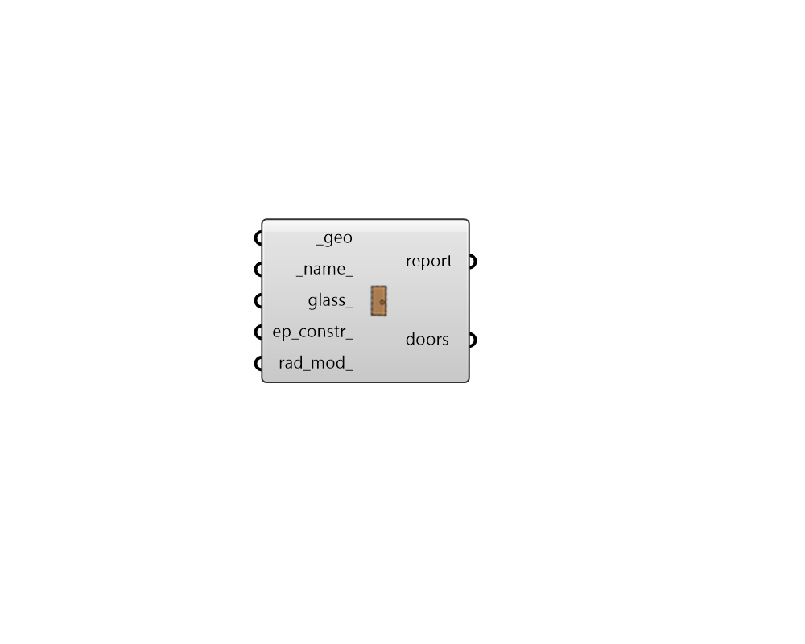
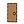

## Door

 - [[source code]](https://github.com/ladybug-tools/honeybee-grasshopper-core/blob/master/ladybug_grasshopper/src//HB%20Door.py)

Create Honeybee Door 

#### Inputs
* ##### geo [Required]
Rhino Brep or Mesh geometry. 
* ##### name 
A name for the Door. If the name is not provided a random name will be assigned. 
* ##### glass 
Boolean to note whether the Door is transparent. Default: False. 
* ##### ep_constr 
Optional text for the Door's energy construction to be looked up in the construction library. This can also be a custom construction object. If no energy construction is input here, a default will be assigned based on the properties of the parent face that the Door is assigned to (ie. whether the Face is a RoofCeiling, whether it has a Surface boundary condition, etc.) 
* ##### rad_mod 
Optional text for the Door's radiance modifier to be looked up in the modifier library. This can also be a custom modifier object. If no radiance modifier is input here, a default will be assigned based on the properties of the parent face that the Door is assigned to (ie. whether the Face is a RoofCeiling, whether it has a Surface boundary condition, etc.) 

#### Outputs
* ##### report
Reports, errors, warnings, etc. 
* ##### doors
Honeybee doors. These can be used directly in radiance simulations or can be added to a Honeybee face for energy simulation. 