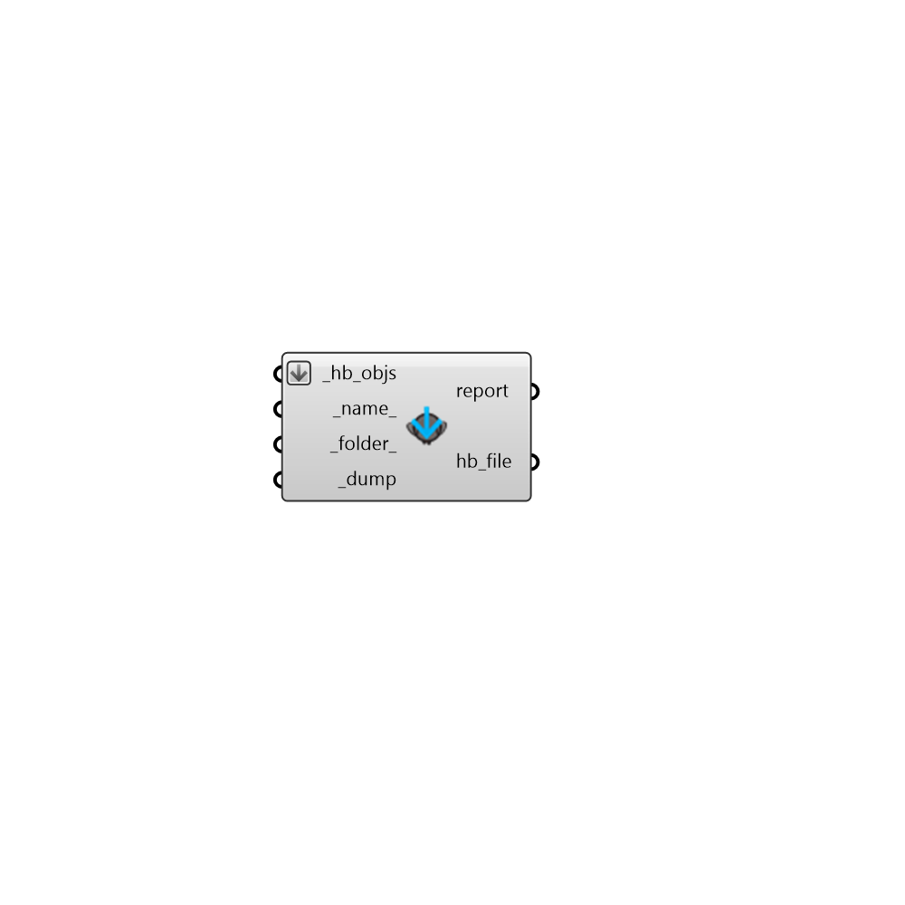

## Dump Compressed Objects

 - [[source code]](https://github.com/ladybug-tools/honeybee-grasshopper-core/blob/master/honeybee_grasshopper_core/src//HB%20Dump%20Compressed%20Objects.py)

Dump any honeybee object to a compressed .pkl file. You can use "HB Load Compressed Objects" component to load the objects from the file back into Grasshopper. 

Honeybee objects include any Model, Room, Face, Aperture, Door, Shade, or boundary condition object 

It also includes any honeybee energy Material, Construction, ConstructionSet, Schedule, Load, ProgramType, or Simulation object. 

#### Inputs
* ##### hb_objs [Required]
A Honeybee object (or list of Honeybee objects) to be written to a file. 
* ##### name 
A name for the file to which the honeybee objects will be written. (Default: 'unnamed'). 
* ##### folder 
An optional directory into which the honeybee objects will be written.  The default is set to the default simulation folder. 
* ##### dump [Required]
Set to "True" to save the honeybee objects to file. 

#### Outputs
* ##### report
Errors, warnings, etc. 
* ##### hb_file
The location of the file where the honeybee .pkl file is saved. 