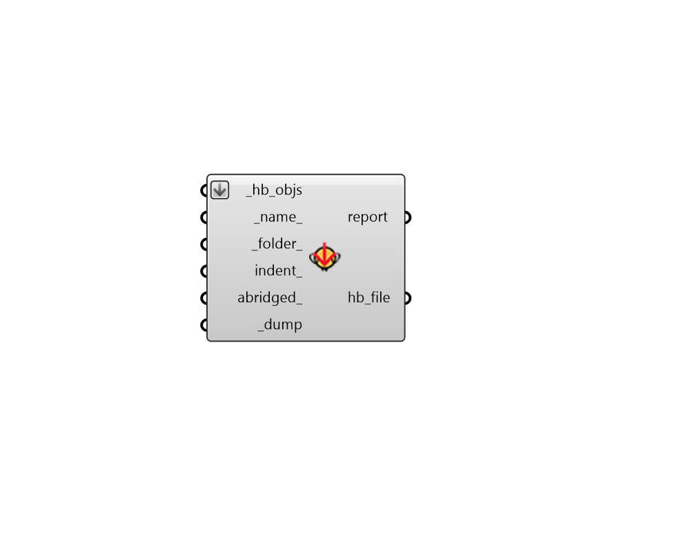

## Dump Objects

 - [[source code]](https://github.com/ladybug-tools/honeybee-grasshopper-core/blob/master/ladybug_grasshopper/src//HB%20Dump%20Objects.py)

Dump any honeybee object to a JSON file. You can use "HB Load Objects" component to load the objects from the file back into Grasshopper. 

Honeybee objects include any Model, Room, Face, Aperture, Door, Shade, or boundary condition object 

It also includes any honeybee energy Material, Construction, ConstructionSet, Schedule, Load, ProgramType, or Simulation object. 

#### Inputs
* ##### hb_objs [Required]
A list of Honeybee objects to be written to a file. 
* ##### name 
A name for the file to which the honeybee objects will be written. (Default: 'unnamed'). 
* ##### folder 
An optional directory into which the honeybee objects will be written.  The default is set to the default simulation folder. 
* ##### indent 
An optional positive integer to set the indentation used in the resulting JSON file. 
* ##### abridged 
Set to "True" to serialize the object in its abridged form. Abridged objects cannot be reserialized back to honeybee objects on their own but they are used throughout honeybee to minimize file size and unnecessary duplication. 
* ##### dump [Required]
Set to "True" to save the honeybee objects to file. 

#### Outputs
* ##### report
Errors, warnings, etc. 
* ##### hb_file
The location of the file where the honeybee JSON is saved. 