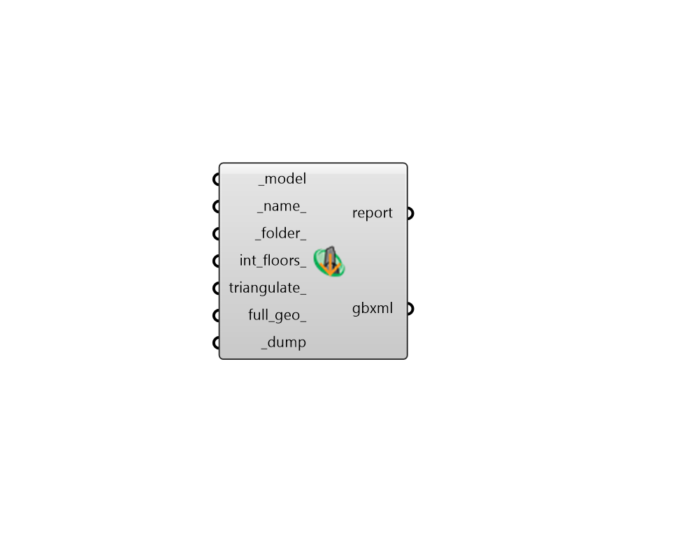

## Dump gbXML

 - [[source code]](https://github.com/ladybug-tools/honeybee-grasshopper-core/blob/master/honeybee_grasshopper_core/src//HB%20Dump%20gbXML.py)

Dump a Honyebee Model to a gbXML file. 

The gbXML format is a common open standard used to transfer energy model geometry and (some) energy simulation properties from one simulation environment to another. 

The forward translators within the OpenStudio SDK are used to export all Honeybee model geometry and properties. 

#### Inputs
* ##### model [Required]
A Honeybee Model object to be written to a gbXML file. 
* ##### name 
A name for the file to which the honeybee objects will be written. If unspecified, it will be derived from the model identifier. 
* ##### folder 
An optional directory into which the honeybee objects will be written.  The default is set to the default simulation folder. 
* ##### triangulate 
Boolean to note whether sub-faces (including Apertures and Doors) should be triangulated if they have more than 4 sides (True) or whether they should be left as they are (False). This triangulation is necessary when exporting directly to EnergyPlus since it cannot accept sub-faces with more than 4 vertices. However, it is not a general requirement of gbXML or all of the simulation engines that gbXML can import to/from. (Default: False). 
* ##### full_geo 
Boolean to note whether space boundaries and shell geometry should be included in the exported gbXML vs. just the minimal required non-manifold geometry. Setting to True to include the full geometry will increase file size without adding much new infomration that doesn't already exist in the file. However, some gbXML interfaces need this geometry in order to properly represent and display room volumes. (Default: False). 
* ##### dump [Required]
Set to "True" to save the honeybee model to a gbXML file. 

#### Outputs
* ##### report
Errors, warnings, etc. 
* ##### gbxml
The location of the file where the honeybee JSON is saved. 