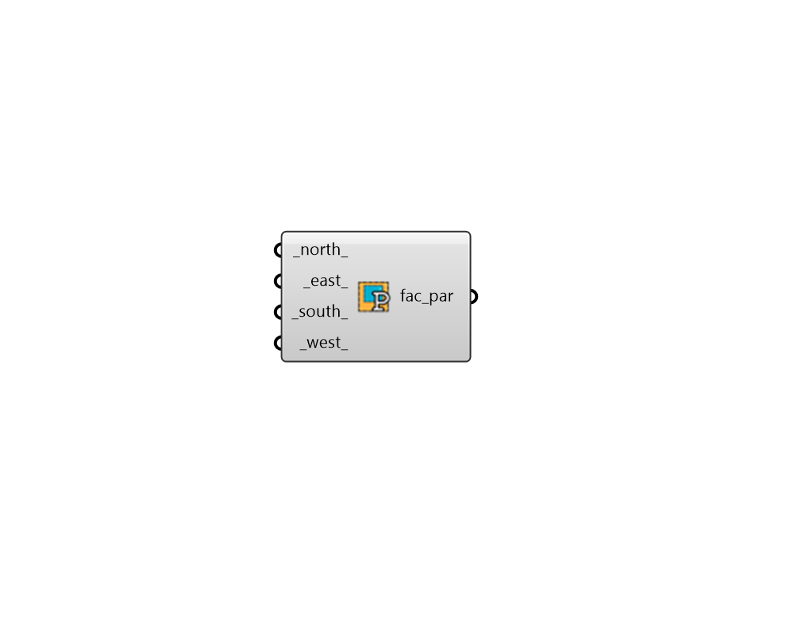

## Facade Parameters

 - [[source code]](https://github.com/ladybug-tools/honeybee-grasshopper-core/blob/master/honeybee_grasshopper_core/src//HB%20Facade%20Parameters.py)

Generate lists of facadce properties ordanized by the four primary cardinal directions. 

Such properties can be glazing ratios, glazing heigths, sill heights, horizontal/ vertical glazing splits for the "HB Apertures by Ratio" component. Or they could be shade depths, angles, etc. for the "HB Louver Shades" component. 

#### Inputs
* ##### north 
Glazing parameter (boolean, float) for the north. 
* ##### east 
Glazing parameter (boolean, float) for the east. 
* ##### south 
Glazing parameter (boolean, float) for the south. 
* ##### west 
Glazing parameter (boolean, float) for the west. 

#### Outputs
* ##### fac_par
A list of properties for different cardinal directions to be plugged into the "HB Apertures by Ratio" component or the "HB Louver Shades" component. 