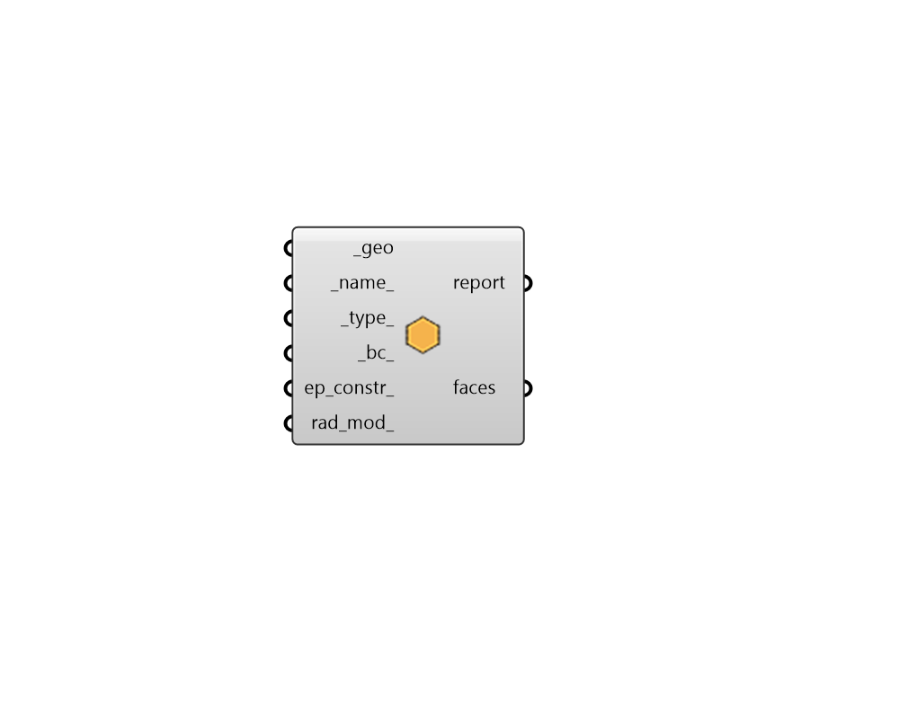

## Face

 - [[source code]](https://github.com/ladybug-tools/honeybee-grasshopper-core/blob/master/honeybee_grasshopper_core/src//HB%20Face.py)

Create Honeybee Face 

#### Inputs
* ##### geo [Required]
Rhino Brep or Mesh geometry. 
* ##### name 
Text to set the name for the Face and to be incorporated into unique Face identifier. If the name is not provided, a random name will be assigned. 
* ##### type 
Text for the face type. The face type will be used to set the material and construction for the surface if they are not assigned through the inputs below. The default is automatically set based on the normal direction of the Face (up being RoofCeiling, down being Floor and vertically-oriented being Wall). Choose from the following: 

    - Wall

    - RoofCeiling

    - Floor

    - AirBoundary
* ##### bc 
Text for the boundary condition of the face. The boundary condition is also used to assign default materials and constructions as well as the nature of heat excahnge across the face in energy simulation. Default is Outdoors unless all vertices of the geometry lie below the below the XY plane, in which case it will be set to Ground. Choose from the following: 

    - Outdoors

    - Ground

    - Adiabatic
* ##### ep_constr 
Optional text for the Face's energy construction to be looked up in the construction library. This can also be a custom OpaqueConstruction object. If no energy construction is input here, the face type and boundary condition will be used to assign a default. 
* ##### rad_mod 
Optional text for the Face's radiance modifier to be looked up in the modifier library. This can also be a custom modifier object. If no radiance modifier is input here, the face type and boundary condition will be used to assign a default. 

#### Outputs
* ##### report
Reports, errors, warnings, etc. 
* ##### faces
Honeybee surface. Use this surface directly for daylight simulation or to create a Honeybee zone for Energy analysis. 