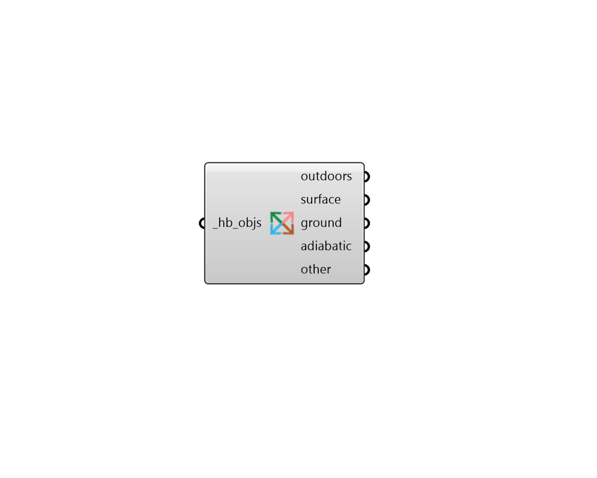

## Faces by BC

 - [[source code]](https://github.com/ladybug-tools/honeybee-grasshopper-core/blob/master/ladybug_grasshopper/src//HB%20Faces%20by%20BC.py)

Separate the faces/sub-faces of honeybee Rooms, Faces, Apertures, Doors or Shades by boundary condition. 

#### Inputs
* ##### hb_objs [Required]
Honeybee Rooms, Faces, Apertures, Doors and/or Shades which will be separated based on boundary condition. This can also be an entire honeybee Model. 

#### Outputs
* ##### outdoors
The objects with an Outdoors boundary condition. 
* ##### surface
The objects with a Surface (interior) boundary condition. 
* ##### ground
The objects with a Ground boundary condition. 
* ##### adiabatic
The objects with an adiabatic (no heat flow) boundary condition. 
* ##### other
All objects with a boundary condition other than the four above. All shades will also be added to this list. 