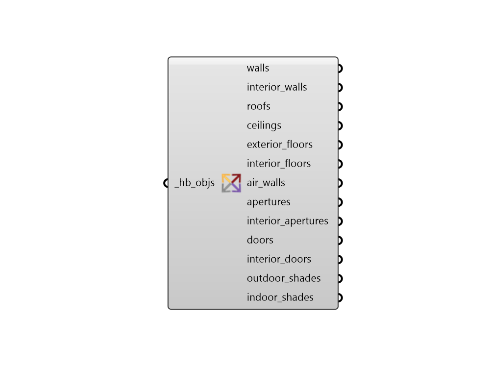

## Faces by Type

 - [[source code]](https://github.com/ladybug-tools/honeybee-grasshopper-core/blob/master/ladybug_grasshopper/src//HB%20Faces%20by%20Type.py)

Separate the faces/sub-faces of honeybee Rooms, Faces, Apertures, Doors, or Shades by object and face type. 

#### Inputs
* ##### hb_objs [Required]
Honeybee Rooms, Faces, Apertures, Doors and/or Shades which will be separated based on object and face type. This can also be an entire honeybee Model. 

#### Outputs
* ##### walls
The Walls with an Outdoors or Ground boundary condition. 
* ##### interior_walls
The Walls with a Surface or Adiabatic boundary condition. 
* ##### roofs
The RoofCeilings with an Outdoors or Ground boundary condition. 
* ##### ceilings
The RoofCeilings with a Surface or Adiabatic boundary condition. 
* ##### exterior_floors
The Floors with an Outdoors or Ground boundary condition. 
* ##### interior_floors
The Floors with a Surface or Adiabatic boundary condition. 
* ##### air_walls
The AirWalls. 
* ##### apertures
The Apertures with an Outdoors boundary condition. 
* ##### interior_apertures
The Apertures with a Surface boundary condition. 
* ##### doors
The Doors with an Outdoors boundary condition. 
* ##### interior_doors
The Doors with a Surface boundary condition. 
* ##### outdoor_shades
The Shades assigned to the outdoors of their parent objects. This also includes all orphaned shades of a model. 
* ##### indoor_shades
The Shades assigned to the indoors of their parent objects. 