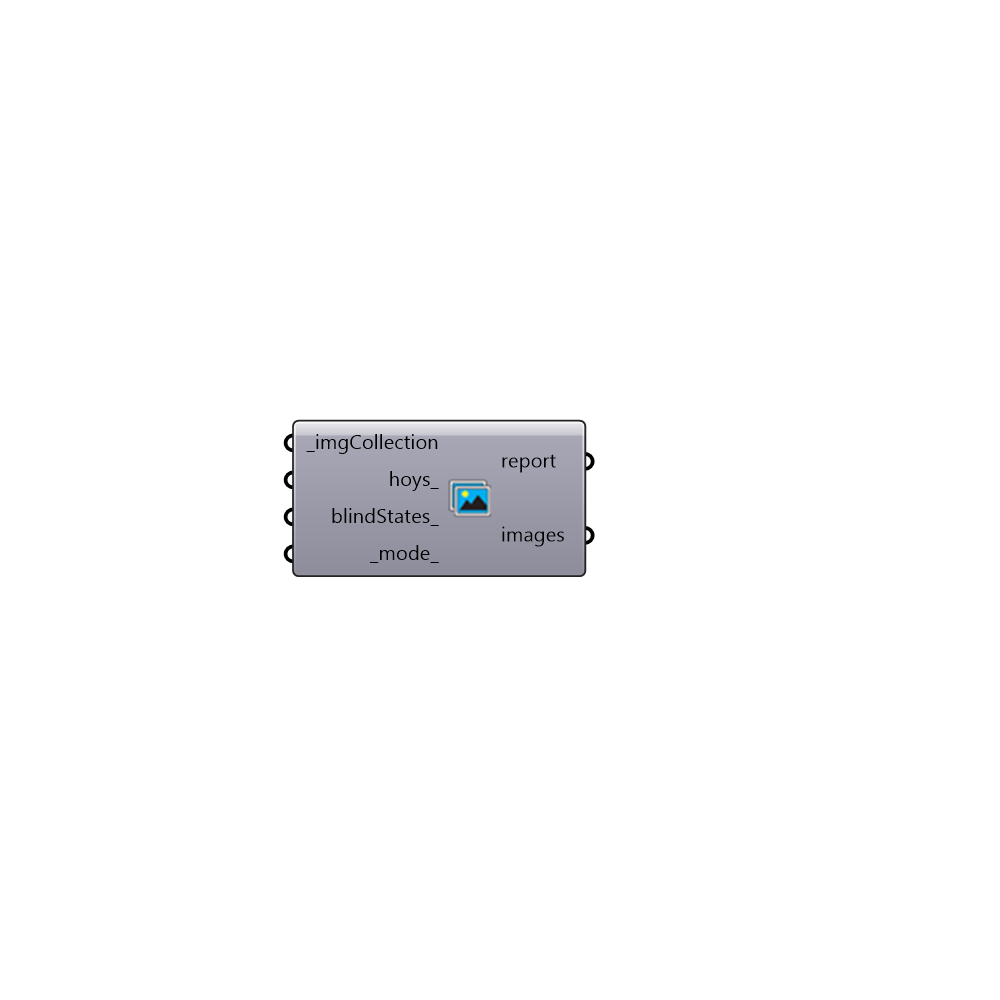

##  Generate Images - [[source code]](https://github.com/ladybug-tools/honeybee-grasshopper/tree/master/plugin/grasshopper/src/HoneybeePlus_Generate%20Images.py)

Hourly results for a sensor for several hours during the year.
 -

#### Inputs
* ##### imgCollection [Required]
An imgage collection from the results of an image-based
 study.
* ##### hoys [Optional]
An optional list of hours for hours of the year if you don't want
 the analysis to be calculated for all the hours.
* ##### blindStates [Optional]
A list of blind states for light sources as tuples for
 hours of the year. You can use Dynamic Blinds Schedule component
 to generate this schedule. If left empty the first state of each
 window group will be used.
* ##### mode [Default]
An integer between 0-3.
 0 returns the combined image of the sources with total - direct + sun values
 1 returns the combined image of the sources with total values
 2 returns the combined image of the sources with direct values
 3 returns the combined image of the sources with sun values

#### Outputs
* ##### report
The filepath of the image taken with this component.
* ##### images
The filepath of the image taken with this component.

[Check Hydra Example Files for Generate Images](https://hydrashare.github.io/hydra/index.html?keywords=HoneybeePlus_Generate Images)