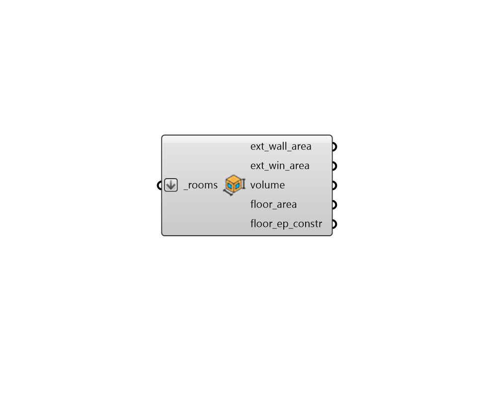

## Geometry Properties

 - [[source code]](https://github.com/ladybug-tools/honeybee-grasshopper-core/blob/master/honeybee_grasshopper_core/src//HB%20Geometry%20Properties.py)

Get geometry properties of honeybee Rooms or a honeybee Model. 

#### Inputs
* ##### rooms [Required]
A list of honeybee Rooms for which or geometry properties will be output. This can also be an entire honeybee Model. 

#### Outputs
* ##### ext_wall_area
A number for the total area of walls in the honeybee rooms with an Outdoors boundary condition (in Rhino model units). 
* ##### ext_win_area
A number for the total area of windows in the honeybee rooms with an Outdoors boundary condition (in Rhino model units). 
* ##### volume
A number for the volume of the honeybee rooms (in Rhino model units). 
* ##### floor_area
A number for the floor area  of the honeybee rooms (in Rhino model units). When a Model is connected, the floor area will exclude plenums and other Rooms with that have a True exclude_floor_area property. 
* ##### floor_ep_constr
A number for the floor area of the Room accounting for the thickness of EnergyPlus wall constructions. (in Rhino model units). When a Model is connected, the floor area will exclude plenums and other Rooms with that have a True exclude_floor_area property. 