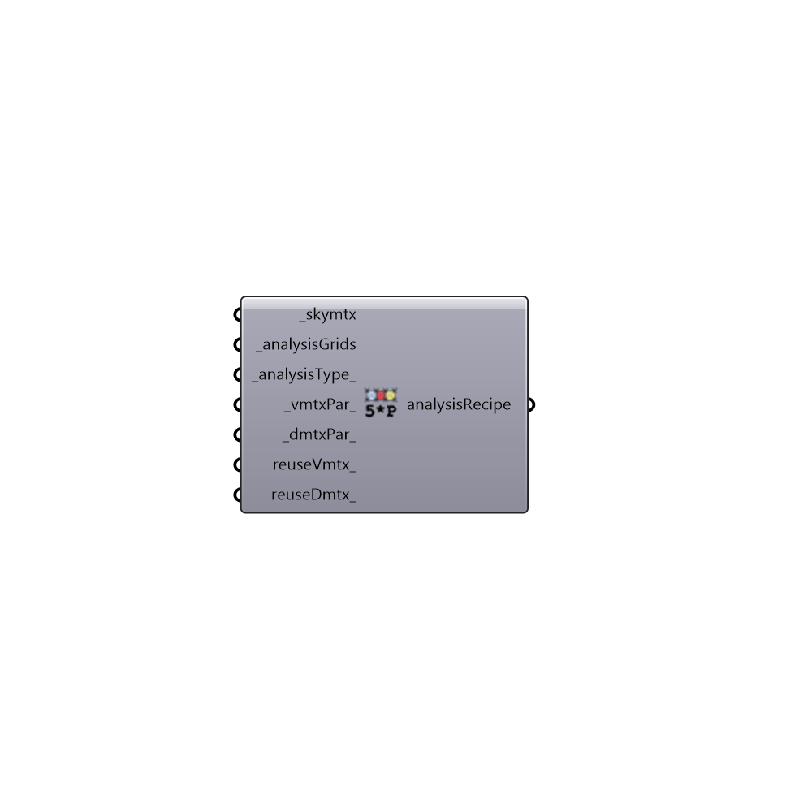

##  Grid-Based Five-Phase Daylight Recipe - [[source code]](https://github.com/ladybug-tools/honeybee-grasshopper/tree/master/plugin/grasshopper/src/HoneybeePlus_Grid-Based%20Five-Phase%20Daylight%20Recipe.py)

Five-pahse daylight Recipe.
 -

#### Inputs
* ##### skymtx [Required]
A sky matrix or a sky vector. Find honeybee skies under 02::Daylight::Light Sources.
* ##### analysisGrids [Required]
A list of Honeybee analysis grids.
* ##### analysisType [Default]
Analysis type. [0] illuminance(lux), [1] radiation (kwh),
 [2] luminance (Candela).
* ##### vmtxPar [Default]
Script variable threePhaseRecipe
* ##### dmtxPar [Default]
Script variable threePhaseRecipe
* ##### reuseVmtx [Optional]
Script variable annualRecipe
* ##### reuseDmtx [Optional]
Script variable threePhaseRecipe

#### Outputs
* ##### analysisRecipe
Five-pahse analysis recipe. Connect this recipe to Run
 Radiance Analysis.

[Check Hydra Example Files for Grid-Based Five-Phase Daylight Recipe](https://hydrashare.github.io/hydra/index.html?keywords=HoneybeePlus_Grid-Based Five-Phase Daylight Recipe)