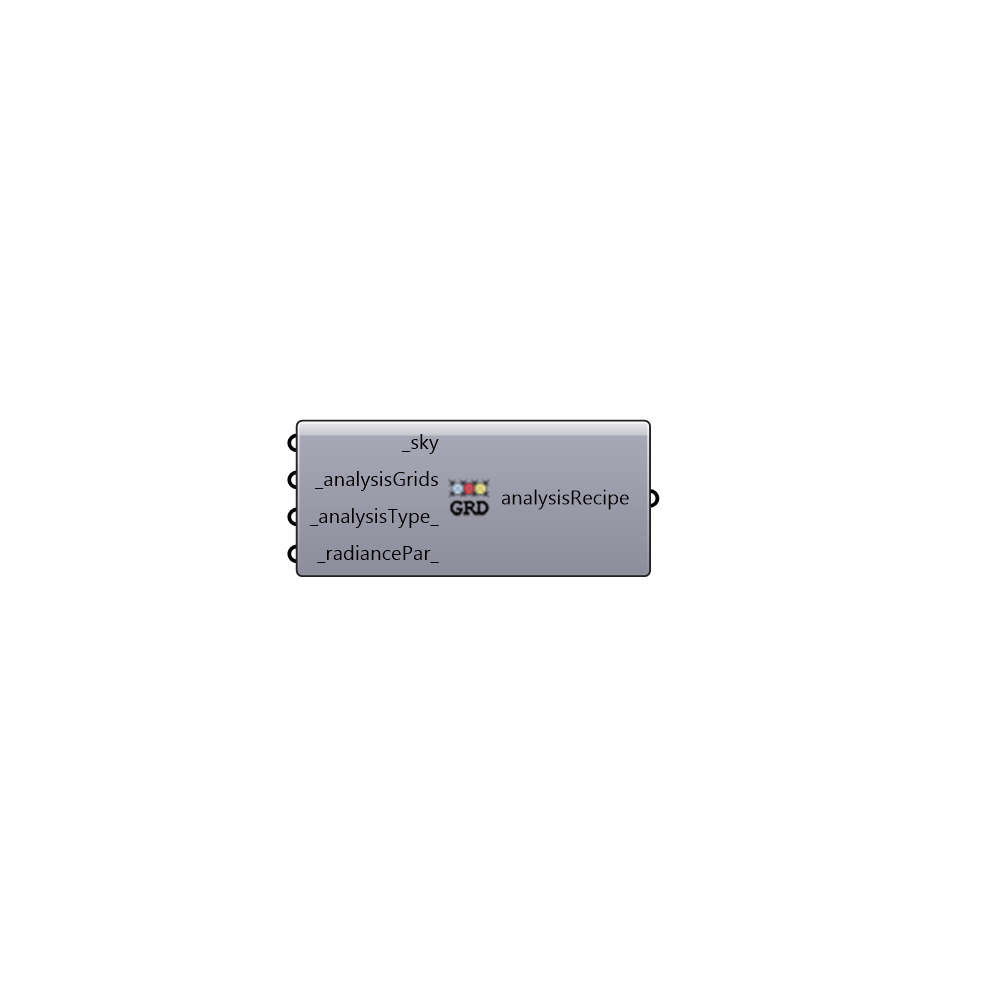

##  Grid-Based Recipe - [[source code]](https://github.com/ladybug-tools/honeybee-grasshopper/tree/master/plugin/grasshopper/src/HoneybeePlus_Grid-Based%20Recipe.py)

Grid-based Recipe.
 -

#### Inputs
* ##### sky [Required]
A radiance sky. Find honeybee skies under 02::Daylight::Light Sources.
* ##### analysisGrids [Required]
A list of analysis grids.
* ##### analysisType [Default]
Analysis type. [0] illuminance(lux), [1] radiation (kwh),
 [2] luminance (Candela).
* ##### radiancePar [Default]
Radiance parameters for Grid-based analysis. Find Radiance
 parameters node under 03::Daylight::Recipes.

#### Outputs
* ##### analysisRecipe
Grid-based analysis recipe. Connect this recipe to
 Run Radiance Analysis to run a grid-based analysis.

[Check Hydra Example Files for Grid-Based Recipe](https://hydrashare.github.io/hydra/index.html?keywords=HoneybeePlus_Grid-Based Recipe)