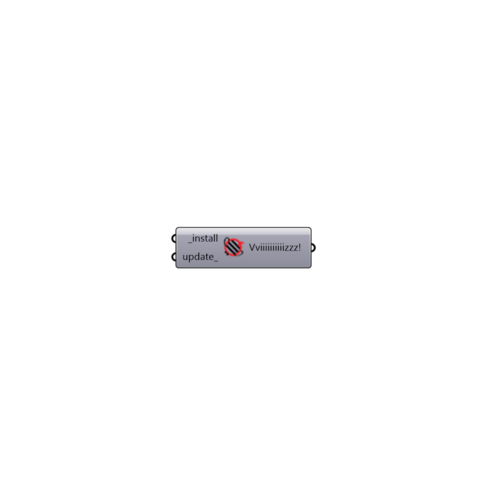

##  HoneybeePlus Installer - [[source code]](https://github.com/ladybug-tools/honeybee-grasshopper/tree/master/plugin/grasshopper/src/HoneybeePlus%20Installer.py)

This component downloads honeybee libraries from github to:
 C:\Users\%USERNAME%\AppData\Roaming\McNeel\Rhinoceros\5.0\scripts
 -

#### Inputs
* ##### install [Required]
Optional path to load butterfly libraries instead of the
 installed version
* ##### update [Optional]
Optional boolean to update honeybee even if you have it already installed.

#### Outputs
* ##### Vviiiiiiiiiizzz!
!!!

[Check Hydra Example Files for HoneybeePlus Installer](https://hydrashare.github.io/hydra/index.html?keywords=HoneybeePlus Installer)