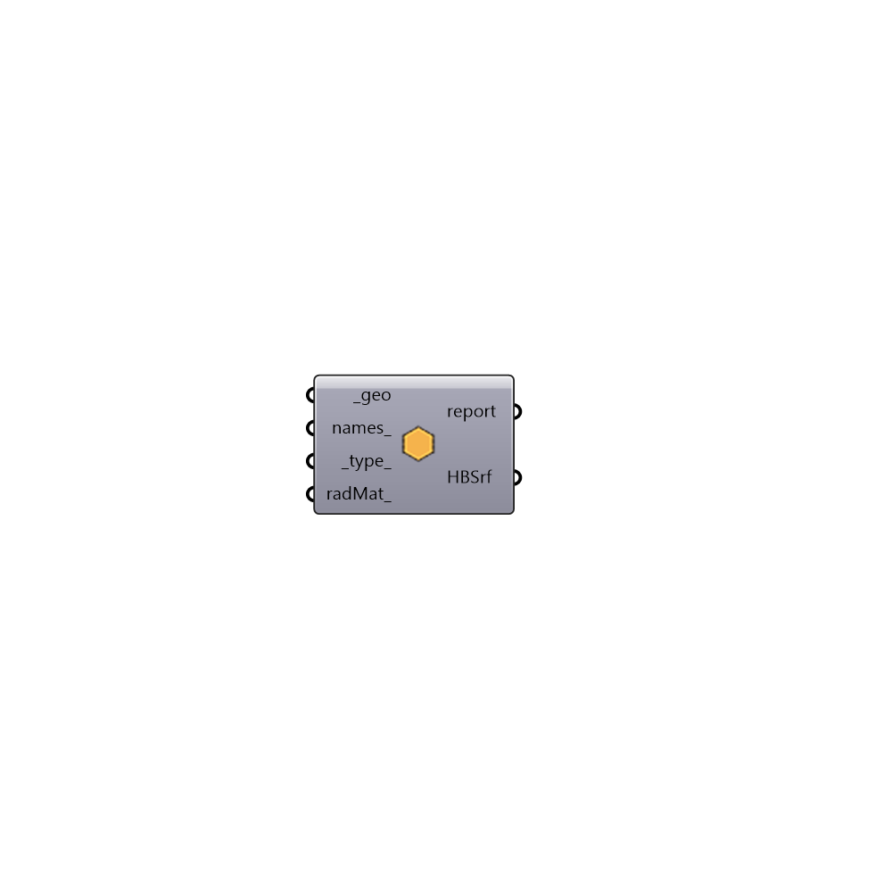

##  Honeybee Surface

Honeybee Surface
 -

#### Inputs
* ##### geo [Required]
A list of input geometries.
* ##### names [Optional]
A name or a list of names for input geometry. If the name is not
 provided Honeybee will assign a random name to the surface.
* ##### type [Default]
Surface type. Surface type will be used to set the material and
 construction for the surface if they are not assigned by user.
 0   Wall           0.5 UndergroundWall
 1   Roof           1.5 UndergroundCeiling
 2   Floor          2.25 UndergroundSlab
 2.5 SlabOnGrade    2.75 ExposedFloor
 3   Ceiling        4   AirWall
 5   Window         6   Context
* ##### radMat [Optional]
Radiance material. If radiance matrial is not provided the component
 will use the type to assign the default material for the surface. If type
 is also not assigned by user. Honeybee will guess the type of the surface
 based on surface normal vector direction at the center of the surface.

#### Outputs
* ##### report
Reports, errors, warnings, etc.
* ##### HBSrf
Honeybee surface. Use this surface directly for daylight simulation
 or to create a Honeybee zone for Energy analysis.

[Check Hydra Example Files for Honeybee Surface](https://hydrashare.github.io/hydra/index.html?keywords=HoneybeePlus_Honeybee Surface)