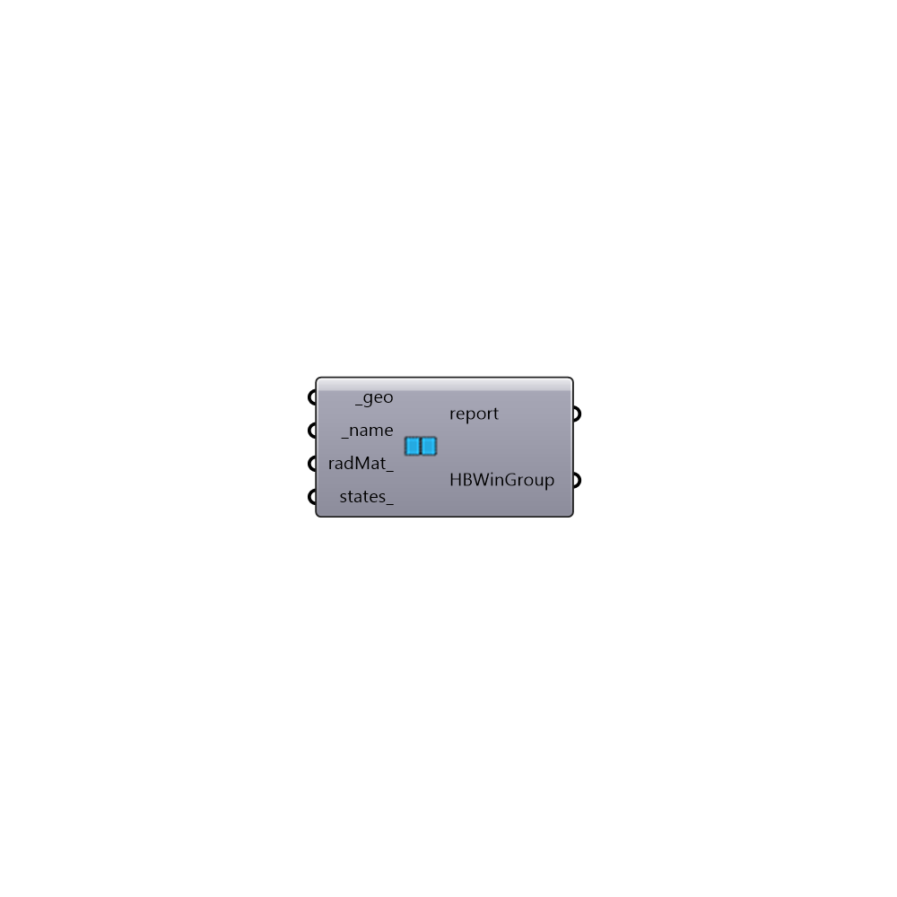

##  Honeybee Window Group - [[source code]](https://github.com/ladybug-tools/honeybee-grasshopper/tree/master/plugin/grasshopper/src/HoneybeePlus_Honeybee%20Window%20Group.py)

Honeybee Window Group
 A window group is a group of HBWindow surfaces which will be grouped together
 for 3-phase daylight analysis. View matrix will be calculated for all the Window
 surfaces in a group once. Window surfaces in a group shoudl have the same normal
 direction, and same BSDF materials will be assigned to all the windows in this
 group.
 -

#### Inputs
* ##### geo [Required]
A list of input geometry.
* ##### name [Required]
A name for this window group. You can use this name later to add
 or remove this group contribution to 3-Phase analysis.
* ##### radMat [Optional]
A Radiance material. If radiance matrial is not provided the
 component will use the type to assign the default material
 (%60 transmittance)for the surface.
* ##### states [Optional]
A list of HBWindow surfaces by similar normal direction.

#### Outputs
* ##### report
Reports, errors, warnings, etc.
* ##### HBWinGroup
List of HBWindowsSrf for this window group.

[Check Hydra Example Files for Honeybee Window Group](https://hydrashare.github.io/hydra/index.html?keywords=HoneybeePlus_Honeybee Window Group)