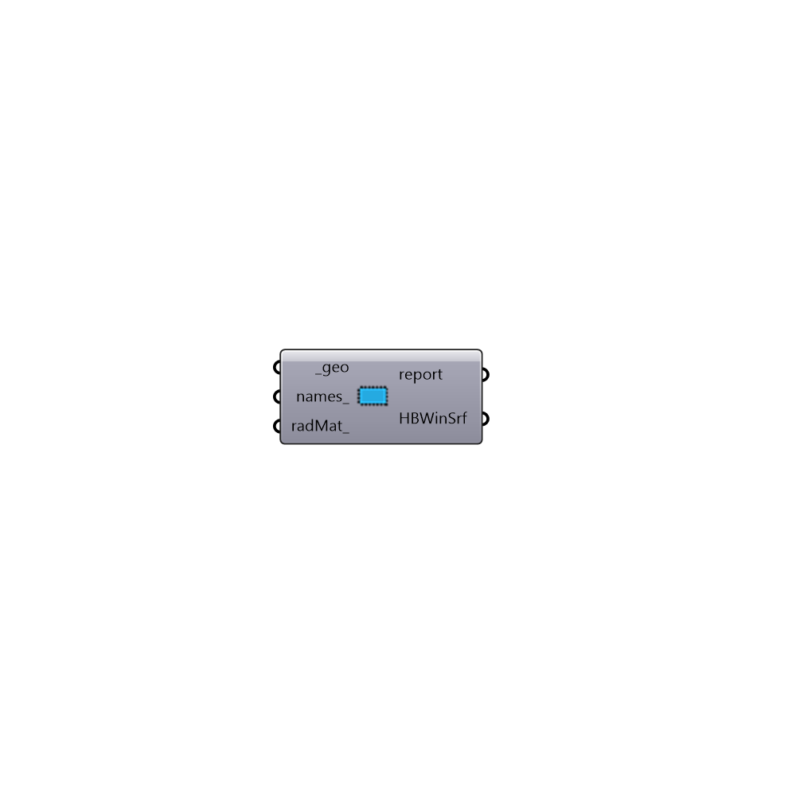

##  Honeybee Window Surface

Honeybee Window Surface
 -

#### Inputs
* ##### geo [Required]
A list of input geometry.
* ##### names [Optional]
A name or a list of names for input geometry. If the name is not
 provided Honeybee will assign a random name to the surface.
* ##### radMat [Optional]
A Radiance material. If radiance matrial is not provided the
 component will use the type to assign the default material
 (%60 transmittance)for the surface.

#### Outputs
* ##### report
Reports, errors, warnings, etc.
* ##### HBWinSrf
Honeybee window surface. Use this surface directly for daylight
 simulation or add it to a honeybee surface or a honeybee zone for
 energy simulation.

[Check Hydra Example Files for Honeybee Window Surface](https://hydrashare.github.io/hydra/index.html?keywords=HoneybeePlus_Honeybee Window Surface)