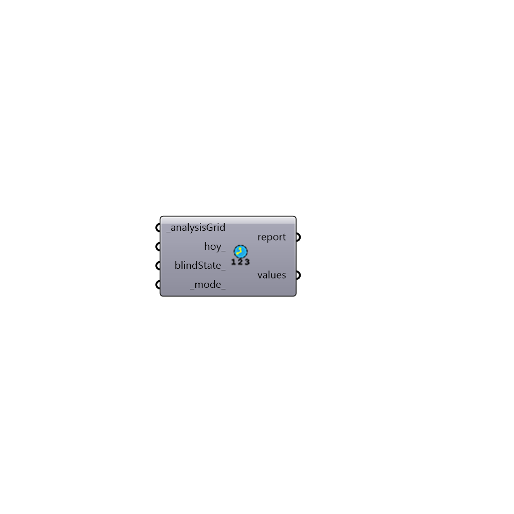

##  Hourly Values - [[source code]](https://github.com/ladybug-tools/honeybee-grasshopper/tree/master/plugin/grasshopper/src/HoneybeePlus_Hourly%20Values.py)

Hourly results for an analysis grid for a single hour of the year.
 -

#### Inputs
* ##### analysisGrid [Required]
An analysis grid output from run Radiance analysis.
* ##### hoy [Optional]
An hour of the year (default: first available hour).
* ##### blindState [Optional]
Blind states for light sources as a tuples. You can use
 If left empty the first state of each window group will be used.
* ##### mode [Default]
An integer between 0-2. 0 returns that total values, 1 returns
 diret values if available and 2 returns sky + diffuse values if
 available.

#### Outputs
* ##### report
The execution information, as output and error streams
* ##### values
List of hourly values for each sensor.

[Check Hydra Example Files for Hourly Values](https://hydrashare.github.io/hydra/index.html?keywords=HoneybeePlus_Hourly Values)