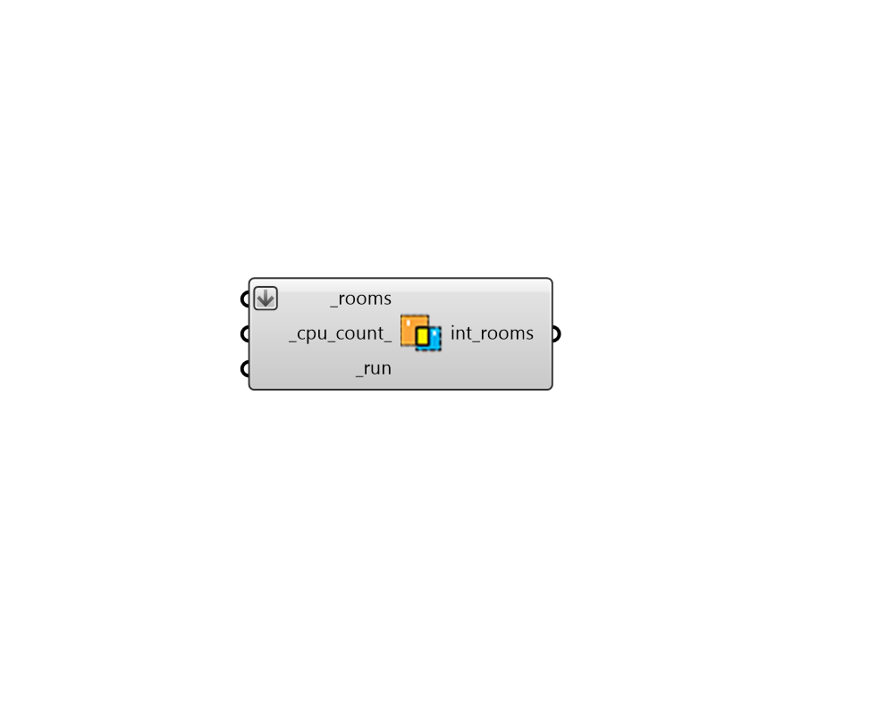

## Intersect Solids

 - [[source code]](https://github.com/ladybug-tools/honeybee-grasshopper-core/blob/master/honeybee_grasshopper_core/src//HB%20Intersect%20Solids.py)

Take a list of Honeybee Rooms closed breps (polysurfaces) and split their Faces to ensure that there are matching coplanar faces between them. 

This matching between Room faces is required in order to contruct a correct multi-room energy model since conductive heat flow won't occur correctly across interior faces when their surface areas do not match. 

#### Inputs
* ##### rooms [Required]
A list of Honeybee Rooms or closed Rhino breps (polysurfaces) that do not have matching adjacent Faces. 
* ##### cpu_count 
An integer to set the number of CPUs used in the execution of the intersection calculation. If unspecified, it will automatically default to one less than the number of CPUs currently available on the machine or 1 if only one processor is available. 
* ##### run [Required]
Set to True to run the component. 

#### Outputs
* ##### int_rooms
The same input Rooms or closed breps that have had their component faces split by adjacent geometries to have matching surfaces. 