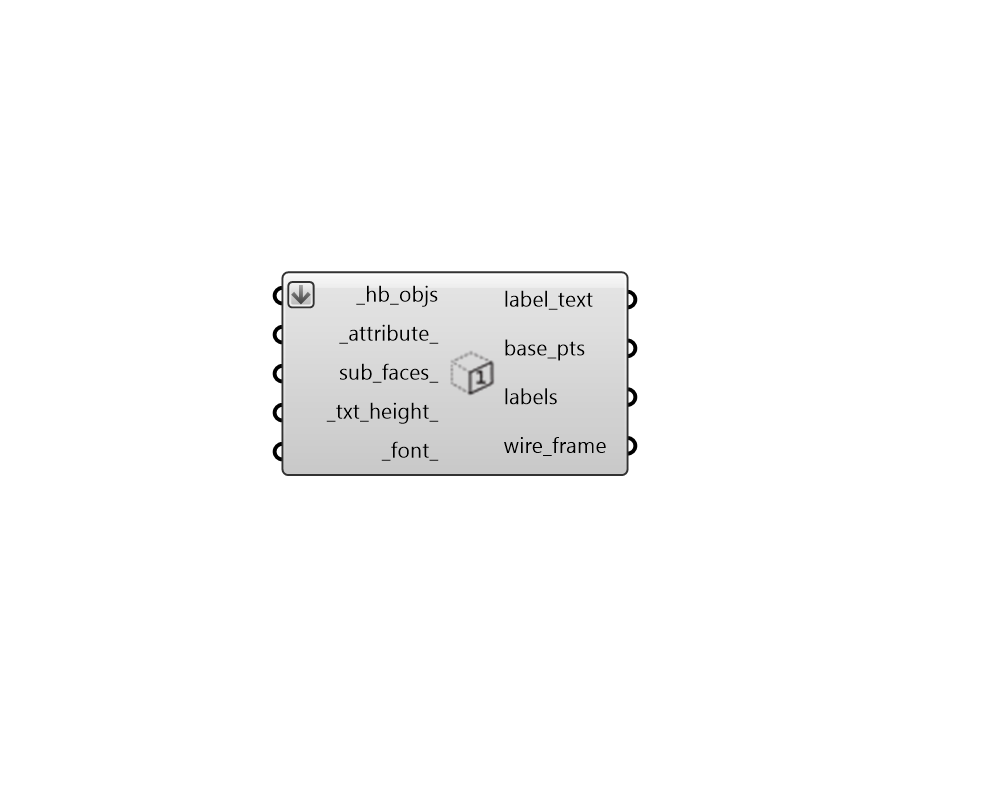

## Label Faces

 - [[source code]](https://github.com/ladybug-tools/honeybee-grasshopper-core/blob/master/ladybug_grasshopper/src//HB%20Label%20Faces.py)

Lablel Honeybee faces and sub-faces with their attributes in the Rhino scene. 

This can be used as a means to check that correct properties are assigned to different faces and sub-faces. 

#### Inputs
* ##### hb_objs [Required]
Honeybee Faces, Rooms or a Model to be labeled with their attributes in the Rhino scene. 
* ##### attribute 
Text for the name of the attribute with which the faces or sub-faces should be labeled. The Honeybee "Face Attributes" component lists all of the core attributes of the room. Also, each Honeybee extension (ie. Radiance, Energy) includes its own component that lists the face and sub-face attributes of that extension. Default: "name". 
* ##### sub_faces 
Set to "True" to have the component label the window surfaces in the model instead of the opaque surfaces.  By default, this is set to "False" to label just the opaque surfaces. 
* ##### txt_height 
An optional number for the height of the text in the Rhino scene.  The default is auto-calculated based on the dimensions of the input geometry. 
* ##### font 
An optional name of a font in which the labels will display. This must be a font that is installed on this machine in order to work correctly. Default: "Arial". 

#### Outputs
* ##### label_text
The text with which each of the faces or sub-faces are labeled. 
* ##### base_pts
The base point for each of the text labels. 
* ##### labels
The text objects that are displaying within the Rhino scene. 
* ##### wire_frame
A list of curves representing the outlines of the faces or sub-faces. This is useful for understanding which geometry elements each label corresponds to. 