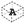

## Label Rooms

 - [[source code]](https://github.com/ladybug-tools/honeybee-grasshopper-core/blob/master/ladybug_grasshopper/src//HB%20Label%20Rooms.py)

Lablel Honeybee rooms with their attributes in the Rhino scene. 

This can be used as a means to check that correct properties are assigned to different Rooms. 

#### Inputs
* ##### rooms_model [Required]
An array of honeybee Rooms or honeybee Models to be labeled with their attributes in the Rhinoscene. 
* ##### attribute 
Text for the name of the Room attribute with which the Rooms should be labeled. The Honeybee "Room Attributes" component lists all of the core attributes of the room. Also, each Honeybee extension (ie. Radiance, Energy) includes its own component that lists the Room attributes of that extension. Default: "name". 
* ##### txt_height 
An optional number for the height of the text in the Rhino scene.  The default is auto-calculated based on the dimensions of the input geometry. 
* ##### font 
An optional name of a font in which the labels will display. This must be a font that is installed on this machine in order to work correctly. Default: "Arial". 

#### Outputs
* ##### label_text
The text with which each of the rooms are labeled. 
* ##### base_pts
The base planes for each of the text labels. 
* ##### labels
The text objects that are displaying within the Rhino scene. 
* ##### wire_frame
A list of curves representing the outlines of the rooms. This is useful for understanding which geometry elements each label corresponds to. 