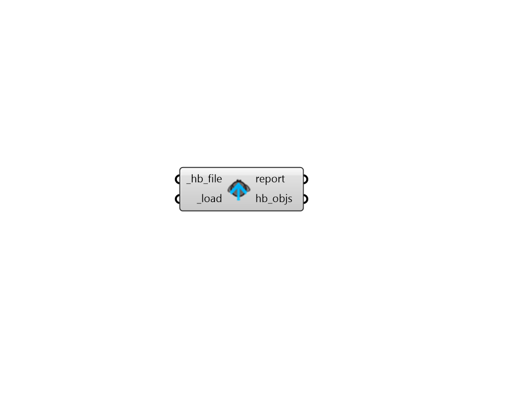

## Load Compressed Objects

 - [[source code]](https://github.com/ladybug-tools/honeybee-grasshopper-core/blob/master/honeybee_grasshopper_core/src//HB%20Load%20Compressed%20Objects.py)

Load any honeybee object from a compressed .pkl or .hbpkl file. 

Honeybee objects include any Model, Room, Face, Aperture, Door, Shade, or boundary condition object. 

It also includes any honeybee energy Material, Construction, ConstructionSet, Schedule, Load, ProgramType, or Simulation object. 

#### Inputs
* ##### hb_file [Required]
A file path to a .pkl or .hbpkl from which objects will be loaded back into Grasshopper. 
* ##### load [Required]
Set to "True" to load the objects from the _hb_file. 

#### Outputs
* ##### report
Reports, errors, warnings, etc. 
* ##### hb_objs
A list of honeybee objects that have been re-serialized from the input file. 